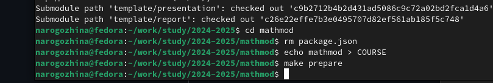

---
## Front matter
lang: ru-RU
title: Подготовка git + markdown.
subtitle: Математическое моделирование
author:
  - Рогожина Н.А.
institute:
  - Российский университет дружбы народов, Москва, Россия
date: 20 февраля 2025

## i18n babel
babel-lang: russian
babel-otherlangs: english

## Formatting pdf
toc: false
toc-title: Содержание
slide_level: 2
aspectratio: 169
section-titles: true
theme: metropolis
header-includes:
 - \metroset{progressbar=frametitle,sectionpage=progressbar,numbering=fraction}
---

# Информация

## Докладчик

:::::::::::::: {.columns align=center}
::: {.column width="70%"}

  * Рогожина Надежда Александровна
  * студентка 3 курса НФИбд-02-22
  * Российский университет дружбы народов
  * [miko.green](mailto:miko.green@yandex.ru)
  * <https://mikogreen.github.io/>

:::
::::::::::::::

# Цель работы

## Цель работы

Настроить репозиторий для курса лабораторных работ по предмету "Математическое моделирование", показать практические навыки владения системой контроля версий `git`, написания отчетов и презентаций на языке `markdown`.

# Задание

## Задание

Склонировать репозиторий с шаблона, написать отчет на языке `markdown`.

# Теоретическое введение

## Что такое git?

Git — это специальная программа, которая позволяет отслеживать любые изменения в файлах, хранить их версии и оперативно возвращаться в любое сохранённое состояние.

Большинство других систем контроля версий хранят информацию в виде списка изменений в файлах. Git работает иначе — он хранит скорее набор снимков — полное отображение того, как выглядит файл в момент сохранения. Это позволяет всегда иметь полную информацию обо всех файлах и быстро восстанавливать любую из предыдущих версий.

# Выполнение лабораторной работы

## Состояние git

Первый делом проверим состояние git. Так как работа с ним велась и на прошлых курсах - донастройка не актуальна.

{#fig:001 width=40%}

## Копирование репозитория

Далее, чтобы создать репозиторий для нашего курса необходимо создать новый репозиторий, скопировав с профиля Дмитрия Сергеевича шаблон репозитория, с которым далее будет вестись работа.

{#fig:002 width=40%}

## Загрузка репозитория

Далее, нам необходимо загрузить созданный репозиторий на локальную машину. Т.к. SSH тоже подключен, делаю это со своего [профиля](https://github.com/MikoGreen) через SSH.

{#fig:003 width=70%}

## Редактирование репозитория

Далее необходимо выполнить 3 команды:
- `rm package.json` - удалить пакетный файл
- `echo mathmod > COURSE` - добавить код курса в текстовый файл `COURSE`
- `make prepare` - сделать репозиторий с помощью `Makefile` актуальным для курса (запуск скрипта обработки)

## Редактирование репозитория

{#fig:004 width=70%}

Результат выполнения команд отображен на моем [профилe](https://github.com/MikoGreen) github.

# Выводы

В ходе лабораторной работы мы настроили репозиторий для курса "Математическое моделирование", а также подготовили отчет по выполненным действиям на языке `markdown` с последующей автоматической компиляцией в word и pdf.

