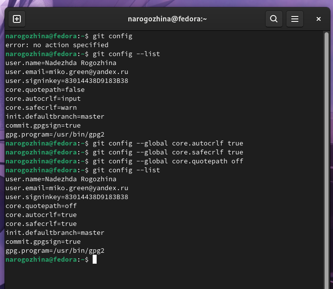
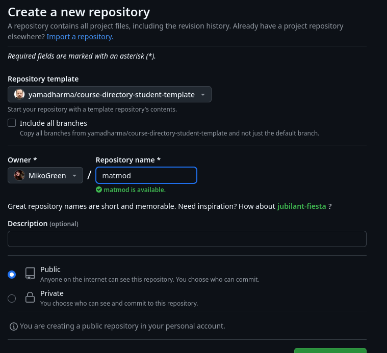
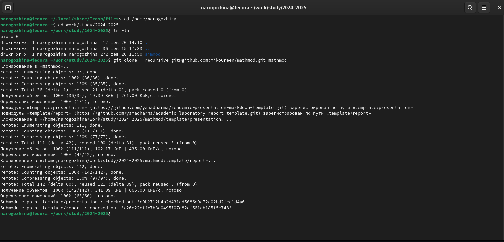
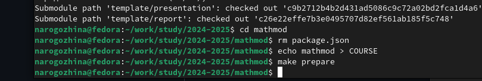

---
## Front matter
title: "Отчёт по лабораторной работе №1"
subtitle: "Математическое моделирование"
author: "Надежда Александровна Рогожина"

## Generic otions
lang: ru-RU
toc-title: "Содержание"

## Bibliography
bibliography: bib/cite.bib
csl: pandoc/csl/gost-r-7-0-5-2008-numeric.csl

## Pdf output format
toc: true # Table of contents
toc-depth: 2
lof: true # List of figures
lot: true # List of tables
fontsize: 12pt
linestretch: 1.5
papersize: a4
documentclass: scrreprt
## I18n polyglossia
polyglossia-lang:
  name: russian
  options:
	- spelling=modern
	- babelshorthands=true
polyglossia-otherlangs:
  name: english
## I18n babel
babel-lang: russian
babel-otherlangs: english
## Fonts
mainfont: IBM Plex Serif
romanfont: IBM Plex Serif
sansfont: IBM Plex Sans
monofont: IBM Plex Mono
mathfont: STIX Two Math
mainfontoptions: Ligatures=Common,Ligatures=TeX,Scale=0.94
romanfontoptions: Ligatures=Common,Ligatures=TeX,Scale=0.94
sansfontoptions: Ligatures=Common,Ligatures=TeX,Scale=MatchLowercase,Scale=0.94
monofontoptions: Scale=MatchLowercase,Scale=0.94,FakeStretch=0.9
mathfontoptions:
## Biblatex
biblatex: true
biblio-style: "gost-numeric"
biblatexoptions:
  - parentracker=true
  - backend=biber
  - hyperref=auto
  - language=auto
  - autolang=other*
  - citestyle=gost-numeric
## Pandoc-crossref LaTeX customization
figureTitle: "Рис."
tableTitle: "Таблица"
listingTitle: "Листинг"
lofTitle: "Список иллюстраций"
lotTitle: "Список таблиц"
lolTitle: "Листинги"
## Misc options
indent: true
header-includes:
  - \usepackage{indentfirst}
  - \usepackage{float} # keep figures where there are in the text
  - \floatplacement{figure}{H} # keep figures where there are in the text
---

# Цель работы

Настроить репозиторий для курса лабораторных работ по предмету "Математическое моделирование", показать практические навыки владения системой контроля версий `git`, написания отчетов и презентаций на языке `markdown`.

# Задание

Склонировать репозиторий с шаблона, написать отчет на языке `markdown`.

# Теоретическое введение

Git — это специальная программа, которая позволяет отслеживать любые изменения в файлах, хранить их версии и оперативно возвращаться в любое сохранённое состояние.

Большинство других систем контроля версий хранят информацию в виде списка изменений в файлах. Git работает иначе — он хранит скорее набор снимков — полное отображение того, как выглядит файл в момент сохранения. Это позволяет всегда иметь полную информацию обо всех файлах и быстро восстанавливать любую из предыдущих версий.

В табл. [-@tbl:std-dir] приведено краткое описание стандартных команд системы git.

: Базовые команды git {#tbl:std-dir}

| Команда | Описание                                                                          |
|---------|-----------------------------------------------------------------------------------|
| `git commit` |  Фиксация изменений |
| `git diff`      | Просмотр актуальных или предыдущих изменений в рамках работы над репозиторием   |
| `git checkout`  | Переход на предыдущее состояние или ветку   |
| `git push`      | Отправка изменений в удаленный репозиторий |
| `git pull`     | Получение изменений из удаленного репозитория |
| `git stash`      | Сохранение изменений в архив для последующего использования         |

# Выполнение лабораторной работы

Первый делом проверим состояние git. Так как работа с ним велась и на прошлых курсах - донастройка не актуальна (рис. [-@fig:001]).

{#fig:001 width=70%}

Далее, чтобы создать репозиторий для нашего курса необходимо создать новый репозиторий, скопировав с профиля Дмитрия Сергеевича шаблон репозитория, с которым далее будет вестись работа (рис. [-@fig:002]).

{#fig:002 width=70%}

Далее, нам необходимо загрузить созданный репозиторий на локальную машину. Т.к. SSH тоже подключен, делаю это со своего [профиля](https://github.com/MikoGreen) через SSH(рис. [-@fig:003]).

{#fig:003 width=70%}

Далее необходимо выполнить 3 команды (рис. [-@fig:004]):
- `rm package.json` - удалить пакетный файл
- `echo mathmod > COURSE` - добавить код курса в текстовый файл `COURSE`
- `make prepare` - сделать репозиторий с помощью `Makefile` актуальным для курса (запуск скрипта обработки)

{#fig:004 width=70%}

Результат выполнения команд отображен на моем [профилe](https://github.com/MikoGreen) github.

# Выводы

В ходе лабораторной работы мы настроили репозиторий для курса "Математическое моделирование", а также подготовили отчет по выполненным действиям на языке `markdown` с последующей автоматической компиляцией в word и pdf.

