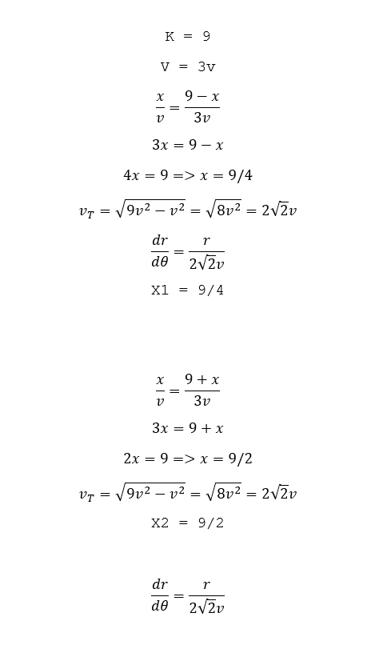
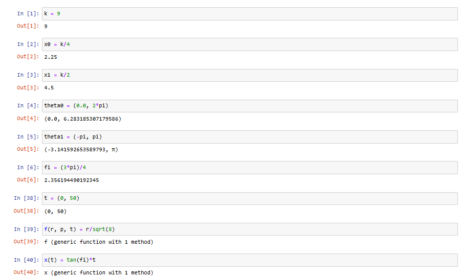
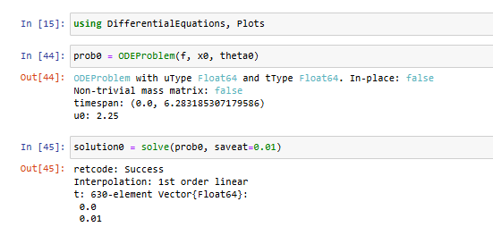
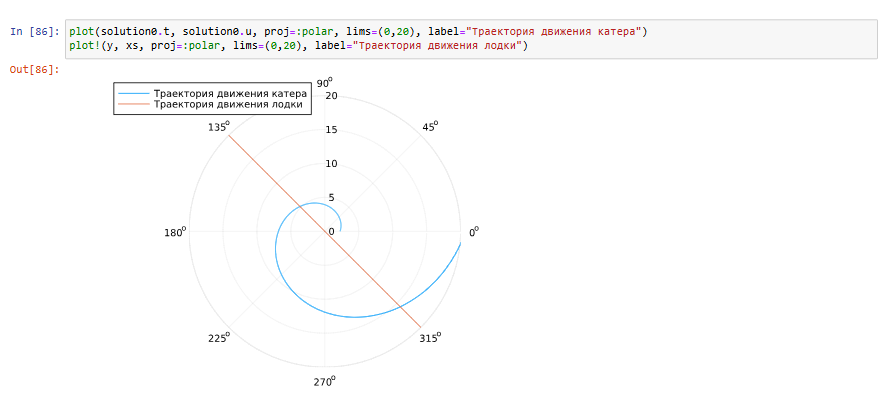
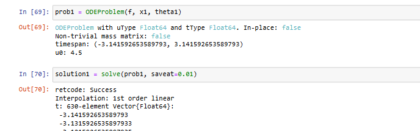
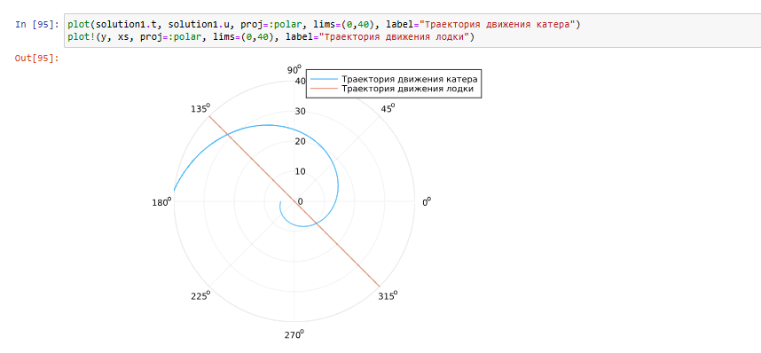
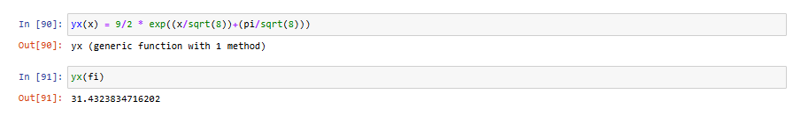

---
## Front matter
lang: ru-RU
title: Задача о погоне.
subtitle: Математическое моделирование
author:
  - Рогожина Н.А.
institute:
  - Российский университет дружбы народов, Москва, Россия
date: 8 марта 2025

## i18n babel
babel-lang: russian
babel-otherlangs: english

## Formatting pdf
toc: false
toc-title: Содержание
slide_level: 2
aspectratio: 169
section-titles: true
theme: metropolis
header-includes:
 - \metroset{progressbar=frametitle,sectionpage=progressbar,numbering=fraction}
---

# Информация

## Докладчик

:::::::::::::: {.columns align=center}
::: {.column width="70%"}

  * Рогожина Надежда Александровна
  * студентка 3 курса НФИбд-02-22
  * Российский университет дружбы народов
  * [miko.green](mailto:miko.green@yandex.ru)
  * <https://mikogreen.github.io/>

:::
::::::::::::::

# Задание

## Задание

Рассмотрим задачу преследования браконьеров береговой охраной. На море в тумане катер береговой охраны преследует лодку браконьеров. Через определенный промежуток времени туман рассеивается, и лодка обнаруживается на расстоянии k км от катера. Затем лодка снова скрывается в тумане и уходит прямолинейно в неизвестном направлении. Известно, что скорость катера в 2 раза больше скорости браконьерской лодки.

## Задание

Необходимо определить по какой траектории необходимо двигаться катеру, чтоб нагнать лодку.

1132222840%70 + 1 = 0 + 1 = 1 -> Вариант 1.

# Выполнение лабораторной работы

## Ключевые уравнения

{#fig:001 width=30%}

## Выполнение лабораторной работы

{#fig:002 width=40%}

## Первая точка

{#fig:003 width=50%}

## Первая точка

{#fig:004 width=45%}

## Первая точка

{#fig:005 width=70%}

## Вторая точка

{#fig:006 width=50%}

## Вторая точка

{#fig:007 width=45%}

## Вторая точка

{#fig:008 width=70%}

# Выводы

## Выводы

В ходе лабораторной работы мы рассмотрели задачу преследования браконьеров береговой охраной, определили по какой траектории необходимо двигаться катеру, чтоб нагнать лодку и нашли точку пересечения катера и лодки.

