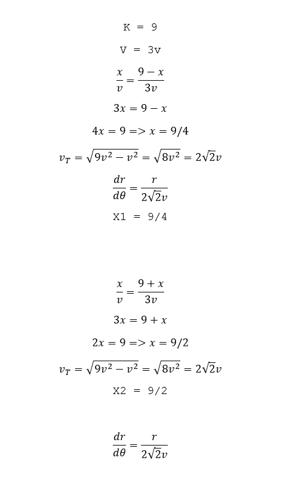
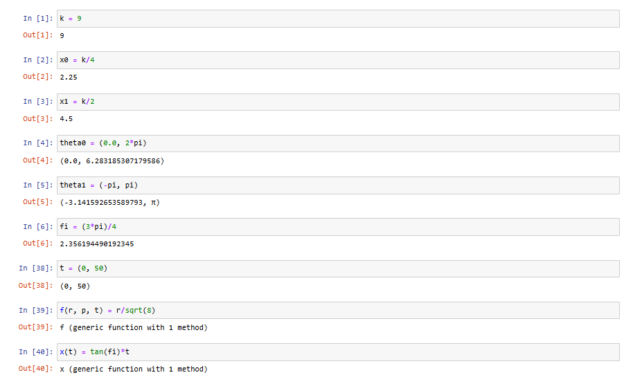
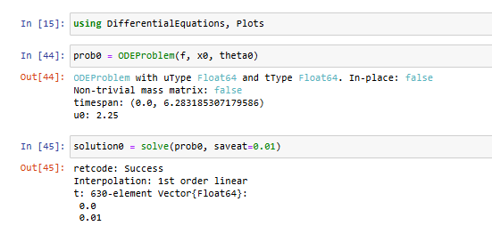
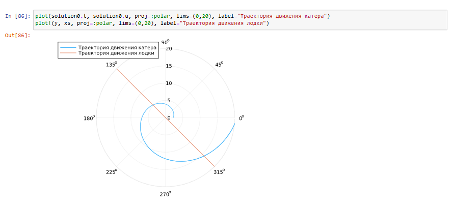
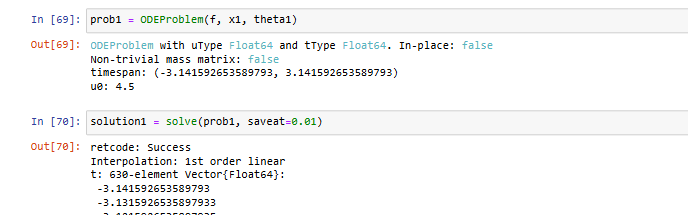
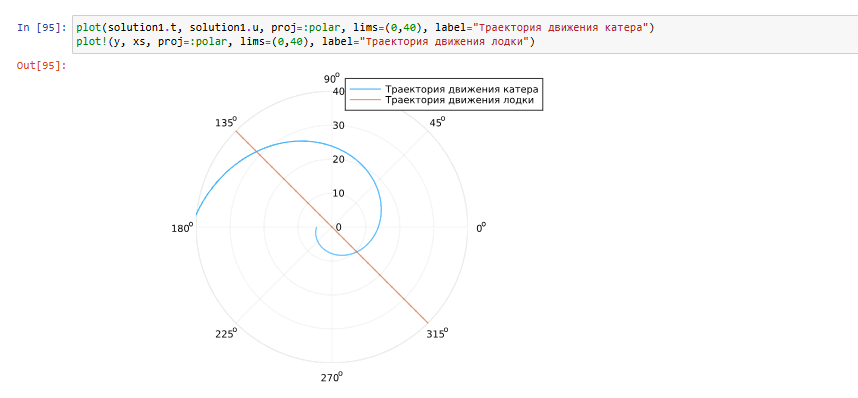

---
## Front matter
title: "Отчёт по лабораторной работе №2"
subtitle: "Математическое моделирование"
author: "Надежда Александровна Рогожина"

## Generic otions
lang: ru-RU
toc-title: "Содержание"

## Bibliography
bibliography: bib/cite.bib
csl: pandoc/csl/gost-r-7-0-5-2008-numeric.csl

## Pdf output format
toc: true # Table of contents
toc-depth: 2
lof: true # List of figures
lot: true # List of tables
fontsize: 12pt
linestretch: 1.5
papersize: a4
documentclass: scrreprt
## I18n polyglossia
polyglossia-lang:
  name: russian
  options:
	- spelling=modern
	- babelshorthands=true
polyglossia-otherlangs:
  name: english
## I18n babel
babel-lang: russian
babel-otherlangs: english
## Fonts
mainfont: IBM Plex Serif
romanfont: IBM Plex Serif
sansfont: IBM Plex Sans
monofont: IBM Plex Mono
mathfont: STIX Two Math
mainfontoptions: Ligatures=Common,Ligatures=TeX,Scale=0.94
romanfontoptions: Ligatures=Common,Ligatures=TeX,Scale=0.94
sansfontoptions: Ligatures=Common,Ligatures=TeX,Scale=MatchLowercase,Scale=0.94
monofontoptions: Scale=MatchLowercase,Scale=0.94,FakeStretch=0.9
mathfontoptions:
## Biblatex
biblatex: true
biblio-style: "gost-numeric"
biblatexoptions:
  - parentracker=true
  - backend=biber
  - hyperref=auto
  - language=auto
  - autolang=other*
  - citestyle=gost-numeric
## Pandoc-crossref LaTeX customization
figureTitle: "Рис."
tableTitle: "Таблица"
listingTitle: "Листинг"
lofTitle: "Список иллюстраций"
lotTitle: "Список таблиц"
lolTitle: "Листинги"
## Misc options
indent: true
header-includes:
  - \usepackage{indentfirst}
  - \usepackage{float} # keep figures where there are in the text
  - \floatplacement{figure}{H} # keep figures where there are in the text
---

# Задание

Рассмотрим задачу преследования браконьеров береговой охраной. На море в тумане катер береговой охраны преследует лодку браконьеров. Через определенный промежуток времени туман рассеивается, и лодка обнаруживается на расстоянии k км от катера. Затем лодка снова скрывается в тумане и уходит прямолинейно в неизвестном направлении. Известно, что скорость катера в 2 раза больше скорости браконьерской лодки.

Необходимо определить по какой траектории необходимо двигаться катеру, чтоб нагнать лодку.

1132222840%70 + 1 = 0 + 1 = 1 -> Вариант 1.

# Выполнение лабораторной работы

Прочитав постановку задачи и свой вариант, определим ключевые уравнения (рис. [-@fig:001]).

{#fig:001 width=70%}

Заведем все необходимые переменные и функции в `jupyter notebook -> Julia` (рис. [-@fig:002]).

{#fig:002 width=70%}

Далее, необходимо найти координаты для 2х случаев. Решение для первой точки (рис. [-@fig:003], рис. [-@fig:004], рис. [-@fig:005]):

{#fig:003 width=70%}

{#fig:004 width=70%}

{#fig:005 width=70%}

И аналогичным образом, ищем для второй точки (рис. [-@fig:006], рис. [-@fig:007], рис. [-@fig:008]):

{#fig:006 width=70%}

{#fig:007 width=70%}

{#fig:008 width=70%}

# Выводы

В ходе лабораторной работы мы рассмотрели задачу преследования браконьеров береговой охраной, определили по какой траектории необходимо двигаться катеру, чтоб нагнать лодку и нашли точку пересечения катера и лодки.

# Список литературы{.unnumbered}

::: {#refs}
:::
