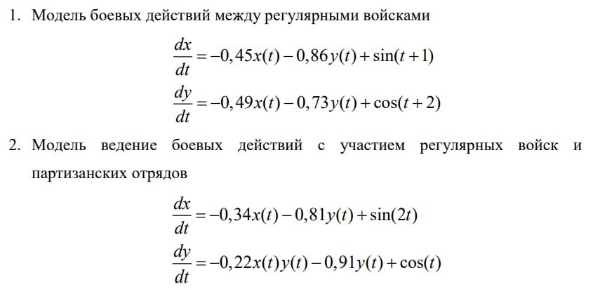

---
## Front matter
lang: ru-RU
title: Модель боевых действий.
subtitle: Математическое моделирование
author:
  - Рогожина Н.А.
institute:
  - Российский университет дружбы народов, Москва, Россия
date: 22 марта 2025

## i18n babel
babel-lang: russian
babel-otherlangs: english

## Formatting pdf
toc: false
toc-title: Содержание
slide_level: 2
aspectratio: 169
section-titles: true
theme: metropolis
header-includes:
 - \metroset{progressbar=frametitle,sectionpage=progressbar,numbering=fraction}
---

# Информация

## Докладчик

:::::::::::::: {.columns align=center}
::: {.column width="70%"}

  * Рогожина Надежда Александровна
  * студентка 3 курса НФИбд-02-22
  * Российский университет дружбы народов
  * [miko.green](mailto:miko.green@yandex.ru)
  * <https://mikogreen.github.io/>

:::
::::::::::::::


# Задание

## Задание

Между страной Х и страной У идет война. Численность состава войск исчисляется от начала войны, и являются временными функциями x(t) и y(t). В начальный момент времени страна Х имеет армию численностью 30 000 человек, а в распоряжении страны У армия численностью в 17 000 человек. Для упрощения модели считаем, что коэффициенты a, b, c, h постоянны. Также считаем P(t) и Q(t) непрерывными функциями.
Постройте графики изменения численности войск армии Х и армии У для следующих случаев:

## Задание

{#fig:001 width=70%}

# Выполнение лабораторной работы

## Первая модель
```
using DifferentialEquations, Plots
u0 = [30000, 17000]
p = [-0.45, -0.86, -0.49, -0.73]
function xy(u, p, t)
    x, y = u
    a, b, c, h = p
    dx = a*x + b*y + sin(t+1)
    
```
## Первая модель
```
    dy = c*x + h*y + cos(t+2)
    return [dx, dy]
end
tspan = (0, 1)
test1 = ODEProblem(xy, u0, tspan, p)
sol = solve(test1, Tsit5())
```

## Вторая модель

```
u0 = [30000, 17000]
p = [-0.34, -0.81, -0.22, -0.91]
function xy(u, p, t)
    x, y = u
    a, b, c, h = p
    dx = a*x + b*y + sin(2*t)
```

## Вторая модель

```
    dy = c*x*y + h*y + cos(t)
    return [dx, dy]
end
test2 = ODEProblem(xy, u0, tspan, p)
sol = solve(test2, Tsit5())
```

## Первая модель

{#fig:002 width=50%}

## Вторая модель

{#fig:003 width=50%}

## Openmodelica

{#fig:004 width=70%}

## Openmodelica

{#fig:005 width=70%}

## Openmodelica

{#fig:006 width=70%}

## Openmodelica

{#fig:007 width=70%}

# Выводы

## Выводы

В ходе лабораторной работы мы смоделировали боевые действия между армией Х и армией Y.


