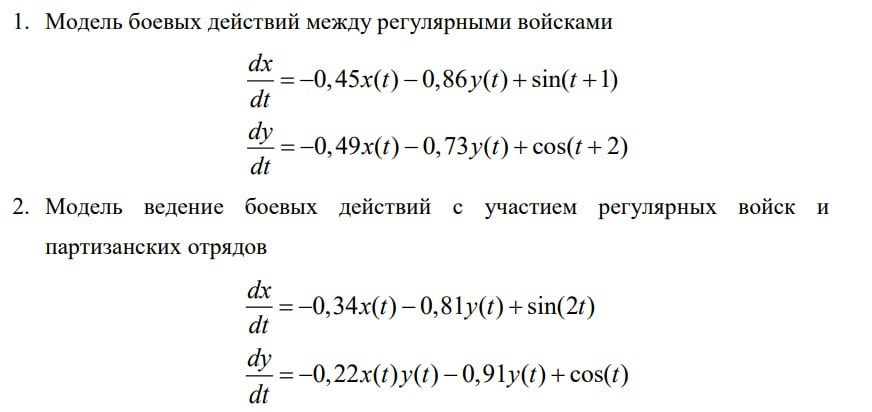
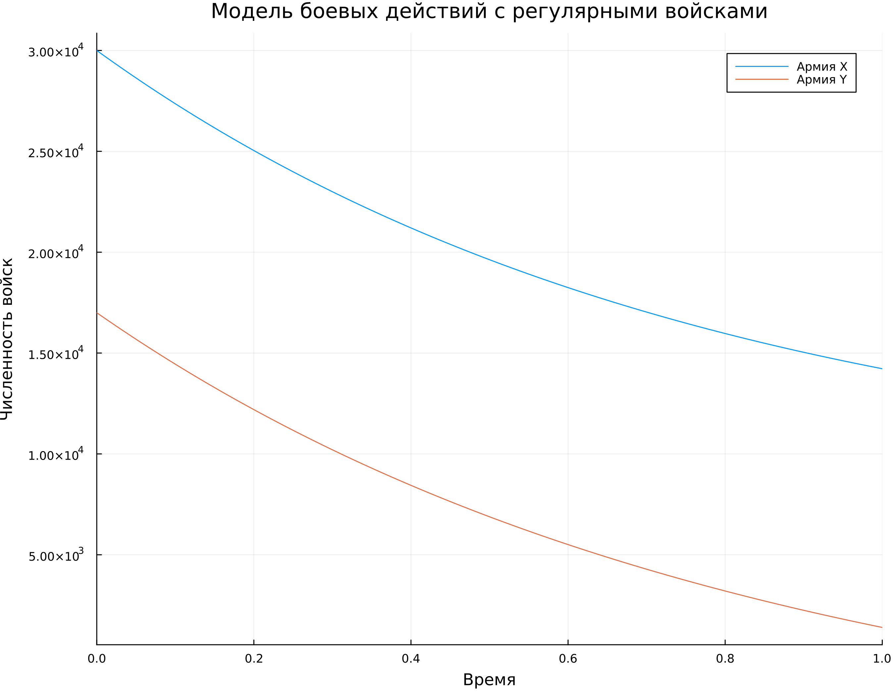
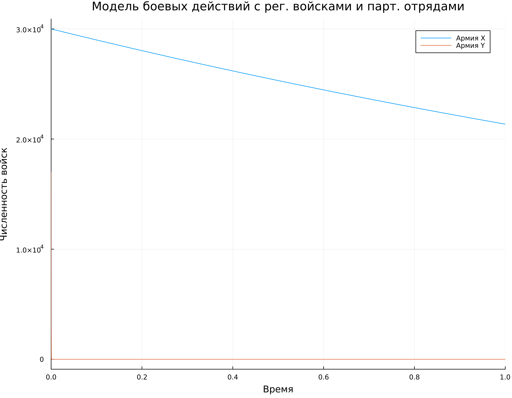
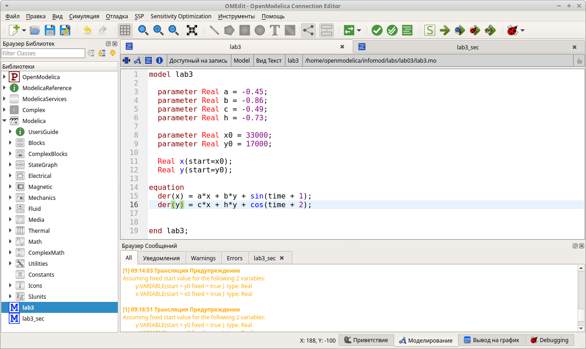
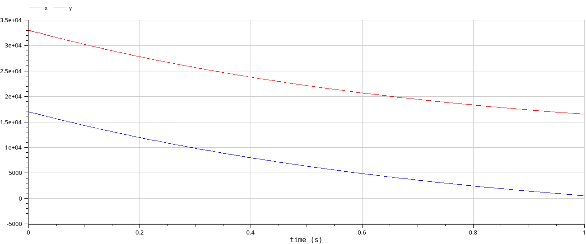
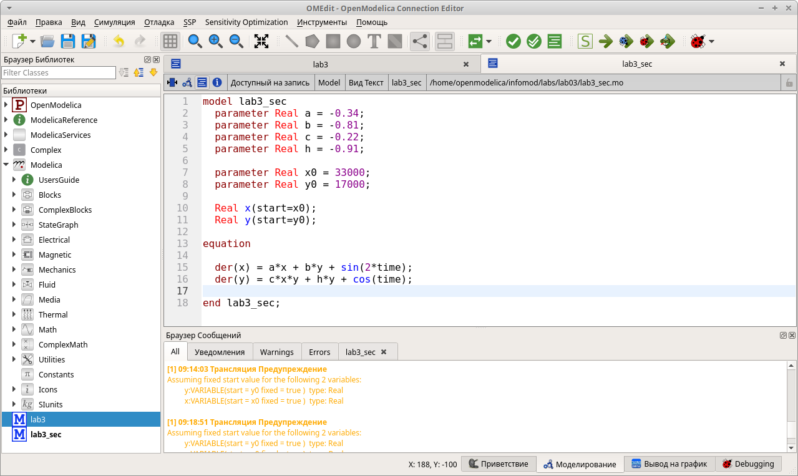
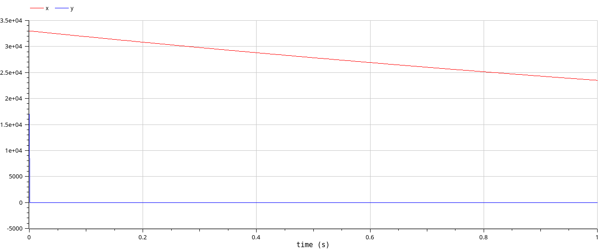

---
## Front matter
title: "Отчёт по лабораторной работе №3"
subtitle: "Модель боевых действий"
author: "Надежда Александровна Рогожина"

## Generic otions
lang: ru-RU
toc-title: "Содержание"

## Bibliography
bibliography: bib/cite.bib
csl: pandoc/csl/gost-r-7-0-5-2008-numeric.csl

## Pdf output format
toc: true # Table of contents
toc-depth: 2
lof: true # List of figures
lot: true # List of tables
fontsize: 12pt
linestretch: 1.5
papersize: a4
documentclass: scrreprt
## I18n polyglossia
polyglossia-lang:
  name: russian
  options:
	- spelling=modern
	- babelshorthands=true
polyglossia-otherlangs:
  name: english
## I18n babel
babel-lang: russian
babel-otherlangs: english
## Fonts
mainfont: IBM Plex Serif
romanfont: IBM Plex Serif
sansfont: IBM Plex Sans
monofont: IBM Plex Mono
mathfont: STIX Two Math
mainfontoptions: Ligatures=Common,Ligatures=TeX,Scale=0.94
romanfontoptions: Ligatures=Common,Ligatures=TeX,Scale=0.94
sansfontoptions: Ligatures=Common,Ligatures=TeX,Scale=MatchLowercase,Scale=0.94
monofontoptions: Scale=MatchLowercase,Scale=0.94,FakeStretch=0.9
mathfontoptions:
## Biblatex
biblatex: true
biblio-style: "gost-numeric"
biblatexoptions:
  - parentracker=true
  - backend=biber
  - hyperref=auto
  - language=auto
  - autolang=other*
  - citestyle=gost-numeric
## Pandoc-crossref LaTeX customization
figureTitle: "Рис."
tableTitle: "Таблица"
listingTitle: "Листинг"
lofTitle: "Список иллюстраций"
lotTitle: "Список таблиц"
lolTitle: "Листинги"
## Misc options
indent: true
header-includes:
  - \usepackage{indentfirst}
  - \usepackage{float} # keep figures where there are in the text
  - \floatplacement{figure}{H} # keep figures where there are in the text
---

# Цель работы

Построить модель боевых действий.

# Задание

Между страной Х и страной У идет война. Численность состава войск исчисляется от начала войны, и являются временными функциями x(t) и y(t). В начальный момент времени страна Х имеет армию численностью 30 000 человек, а в распоряжении страны У армия численностью в 17 000 человек. Для упрощения модели считаем, что коэффициенты a, b, c, h постоянны. Также считаем P(t) и Q(t) непрерывными функциями.
Постройте графики изменения численности войск армии Х и армии У для следующих случаев (рис. [-@fig:001])

{#fig:001 width=70%}

# Выполнение лабораторной работы

Код для модели боевых действий в юпитере выглядит следующим образом:
```
using DifferentialEquations, Plots
u0 = [30000, 17000]
p = [-0.45, -0.86, -0.49, -0.73]
function xy(u, p, t)
    x, y = u
    a, b, c, h = p
    dx = a*x + b*y + sin(t+1)
    dy = c*x + h*y + cos(t+2)
    return [dx, dy]
end
tspan = (0, 1)
test1 = ODEProblem(xy, u0, tspan, p)
sol = solve(test1, Tsit5())
```
для первой модели, и
```
u0 = [30000, 17000]
p = [-0.34, -0.81, -0.22, -0.91]
function xy(u, p, t)
    x, y = u
    a, b, c, h = p
    dx = a*x + b*y + sin(2*t)
    dy = c*x*y + h*y + cos(t)
    return [dx, dy]
end
test2 = ODEProblem(xy, u0, tspan, p)
sol = solve(test2, Tsit5())
```
для второй модели.

Визуализация моделирования отображена на рис. [-@fig:002] и рис. [-@fig:003]

{#fig:002 width=70%}

{#fig:003 width=70%}

Далее, те же самые модели были реализованы в OpenModelica (рис. [-@fig:004], рис. [-@fig:005], рис. [-@fig:006], рис. [-@fig:007]).

{#fig:004 width=70%}

{#fig:005 width=70%}

{#fig:006 width=70%}

{#fig:007 width=70%}

# Выводы

В ходе лабораторной работы мы смоделировали боевые действия между армией Х и армией Y.

# Список литературы{.unnumbered}

::: {#refs}
:::
