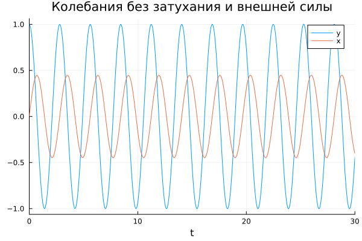

---
## Front matter
lang: ru-RU
title: Модель гармонических колебаний
subtitle: Лабораторная работа №4.
author:
  - Рогожина Н.А.
institute:
  - Российский университет дружбы народов, Москва, Россия
date: 2 мая 2025

## i18n babel
babel-lang: russian
babel-otherlangs: english

## Formatting pdf
toc: false
toc-title: Содержание
slide_level: 2
aspectratio: 169
section-titles: true
theme: metropolis
header-includes:
 - \metroset{progressbar=frametitle,sectionpage=progressbar,numbering=fraction}
---

# Информация

## Докладчик

:::::::::::::: {.columns align=center}
::: {.column width="70%"}

  * Рогожина Надежда Александровна
  * студентка 3 курса НФИбд-02-22
  * Российский университет дружбы народов
  * <https://mikogreen.github.io/>

:::
::::::::::::::

# Задание

## Задание

Постройте фазовый портрет гармонического осциллятора и решение уравнения гармонического осциллятора для следующих случаев:

1. Колебания гармонического осциллятора без затуханий и без действий внешней силы `x''+ 5x = 0`.

2. Колебания гармонического осциллятора c затуханием и без действий внешней силы `x''+ 2x'+ 5x = 0`.

3. Колебания гармонического осциллятора c затуханием и под действием внешней силы `x''+ 4x'+ x = sin(14t)`.

На интервале $t \in [0;30]$ (шаг 0.05) с начальными условиями $x_0 = 0, y_0 = 1$.

# Теоретическое введение

## Теоретическое введение

Движение грузика на пружинке, маятника, заряда в электрическом контуре, а также эволюция во времени многих систем в физике, химии, биологии и других науках при определенных предположениях можно описать одним и тем же дифференциальным уравнением, которое в теории колебаний выступает в качестве основной модели. Эта модель называется линейным гармоническим осциллятором.

# Выполнение лабораторной работы

## Julia

Первоначально, работа была выполнена с помощью языка `Julia` в `Jupyter notebook` с помощью следующего кода:
```
function harm(dx,x,p,t)
    - p[1] * dx - p[2] * x
end

tspan = (0.0, 30.0)
x0 = 0.0
dx0 = 1.0
```

## Julia

```
p1 = [0, 5] # 2*gamma, omega^2
p2 = [2, 5]
p3 = [4, 1]

function harm_p3(dx,x,p,t)
    - p[1] * dx - p[2] * x + sin(14*t)
end
```

## Julia

```
prob1 = SecondOrderODEProblem(harm, dx0, x0, tspan, p1)
num_sol1 = solve(prob1, Tsit5(), saveat=0.05)
plot(num_sol1, label = ["y" "x"], xlabel="t", 
    title = "Колебания без затухания и внешней силы")

plot(num_sol1, label="phase", idxs=(2,1), 
    title="Фазовый портрет без затухания и внешней силы")
```

## Julia

{#fig:001 width=70%}

## Julia

{#fig:002 width=70%}

## Julia

{#fig:003 width=70%}

## Julia

{#fig:004 width=70%}

## Julia

{#fig:005 width=70%}

## Julia

{#fig:006 width=70%}

## OpenModelica

Вторым этапом было необходимо реализовать то же решение с помощью OpenModelica. Применяя следующий код:
```
model lab4
  parameter Real gamma = 2.0;
  parameter Real omega = 5.0;
  parameter Real x0 = 0.0;
  parameter Real y0 = 1.0;
  Real x(start = x0);
  Real y(start = y0);
equation
  der(x) = y;
  der(y) = - gamma * y - omega * x;
end lab4;
```
## OpenModelica

и изменяя параметры `gamma` и `omega` (и добавив sin(14*time) для 3-го случая), были получены следующие решения уравнений и фазовые портреты:

## OpenModelica

{#fig:007 width=60%}

## OpenModelica

{#fig:008 width=60%}

## OpenModelica

{#fig:009 width=60%}

## OpenModelica

{#fig:010 width=60%}

## OpenModelica

{#fig:011 width=60%}

## OpenModelica

{#fig:012 width=60%}

# Выводы

## Выводы 

В ходе лабораторной работы мы смоделировали поведение линейного гармонического осциллятора с "идеальной системе", в системе с потерями энергии, а также в системе с воздействием внешних сил.

