---
## Front matter
title: "Отчёт по лабораторной работе №4"
subtitle: "Модель гармонических колебаний"
author: "Надежда Александровна Рогожина"

## Generic otions
lang: ru-RU
toc-title: "Содержание"

## Bibliography
bibliography: bib/cite.bib
csl: pandoc/csl/gost-r-7-0-5-2008-numeric.csl

## Pdf output format
toc: true # Table of contents
toc-depth: 2
lof: true # List of figures
lot: true # List of tables
fontsize: 12pt
linestretch: 1.5
papersize: a4
documentclass: scrreprt
## I18n polyglossia
polyglossia-lang:
  name: russian
  options:
	- spelling=modern
	- babelshorthands=true
polyglossia-otherlangs:
  name: english
## I18n babel
babel-lang: russian
babel-otherlangs: english
## Fonts
mainfont: IBM Plex Serif
romanfont: IBM Plex Serif
sansfont: IBM Plex Sans
monofont: IBM Plex Mono
mathfont: STIX Two Math
mainfontoptions: Ligatures=Common,Ligatures=TeX,Scale=0.94
romanfontoptions: Ligatures=Common,Ligatures=TeX,Scale=0.94
sansfontoptions: Ligatures=Common,Ligatures=TeX,Scale=MatchLowercase,Scale=0.94
monofontoptions: Scale=MatchLowercase,Scale=0.94,FakeStretch=0.9
mathfontoptions:
## Biblatex
biblatex: true
biblio-style: "gost-numeric"
biblatexoptions:
  - parentracker=true
  - backend=biber
  - hyperref=auto
  - language=auto
  - autolang=other*
  - citestyle=gost-numeric
## Pandoc-crossref LaTeX customization
figureTitle: "Рис."
tableTitle: "Таблица"
listingTitle: "Листинг"
lofTitle: "Список иллюстраций"
lotTitle: "Список таблиц"
lolTitle: "Листинги"
## Misc options
indent: true
header-includes:
  - \usepackage{indentfirst}
  - \usepackage{float} # keep figures where there are in the text
  - \floatplacement{figure}{H} # keep figures where there are in the text
---

# Задание

Постройте фазовый портрет гармонического осциллятора и решение уравнения гармонического осциллятора для следующих случаев:

1. Колебания гармонического осциллятора без затуханий и без действий внешней силы `x''+ 5x = 0`
2. Колебания гармонического осциллятора c затуханием и без действий внешней силы `x''+ 2x'+ 5x=0`
3. Колебания гармонического осциллятора c затуханием и под действием внешней силы `x''+ 4x'+ x = sin(14t)`

На интервале $t \in [0;30]$ (шаг 0.05) с начальными условиями $x_0 = 0, y_0 = 1$.

# Теоретическое введение

Движение грузика на пружинке, маятника, заряда в электрическом контуре, а также эволюция во времени многих систем в физике, химии, биологии и других науках при определенных предположениях можно описать одним и тем же дифференциальным уравнением, которое в теории колебаний выступает в качестве основной модели. Эта модель называется линейным гармоническим осциллятором.

# Выполнение лабораторной работы

Первоначально, работа была выполнена с помощью языка `Julia` в `Jupyter notebook` с помощью следующего кода:
```
function harm(dx,x,p,t)
    - p[1] * dx - p[2] * x
end

tspan = (0.0, 30.0)
x0 = 0.0
dx0 = 1.0

p1 = [0, 5] # 2*gamma, omega^2
p2 = [2, 5]
p3 = [4, 1]

function harm_p3(dx,x,p,t)
    - p[1] * dx - p[2] * x + sin(14*t)
end

prob1 = SecondOrderODEProblem(harm, dx0, x0, tspan, p1)
num_sol1 = solve(prob1, Tsit5(), saveat=0.05)
plot(num_sol1, label = ["y" "x"], xlabel="t", 
    title = "Колебания без затухания и внешней силы")

plot(num_sol1, label="phase", idxs=(2,1), 
    title="Фазовый портрет без затухания и внешней силы")

prob2 = SecondOrderODEProblem(harm, dx0, x0, (0.0, 10.0), p2)
num_sol2 = solve(prob2, Tsit5(), saveat=0.05)
plot(num_sol2, label = ["y" "x"], xlabel="t", 
    title = "Колебания c затухания, но без внешней силы")

plot(num_sol2, label="phase", idxs=(2,1), 
    title="Колебания c затухания, но без внешней силы")

prob3 = SecondOrderODEProblem(harm_p3, dx0, x0, tspan, p3)
num_sol3 = solve(prob3, Tsit5(), saveat=0.05)
plot(num_sol3, label = ["y" "x"], xlabel="t", 
    title = "Колебания c затухания, но без внешней силы")

plot(num_sol3, label="phase", idxs=(2,1), 
    title="Колебания с затуханием и внешней силой")
```

В результате были получены следующие решения уравнений и фазовые портреты (рис. [-@fig:001], рис. [-@fig:002], рис. [-@fig:003], рис. [-@fig:004], рис. [-@fig:005], рис. [-@fig:006]):

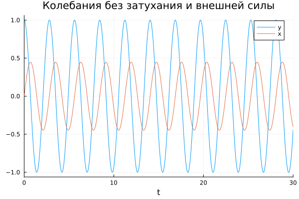{#fig:001 width=70%}

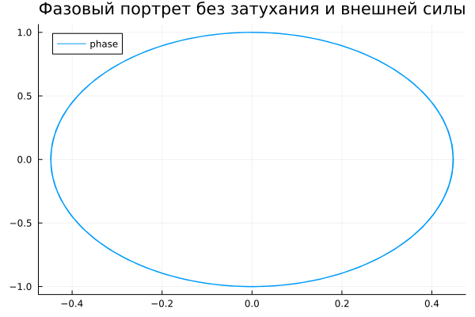{#fig:002 width=70%}

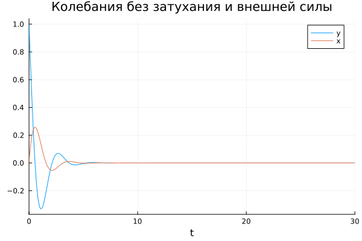{#fig:003 width=70%}

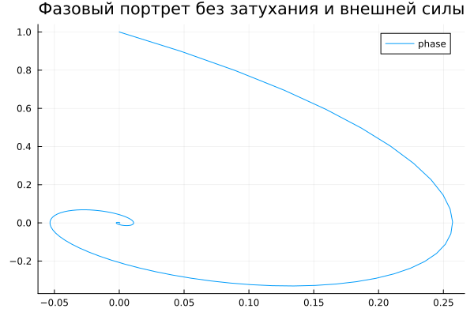{#fig:004 width=70%}

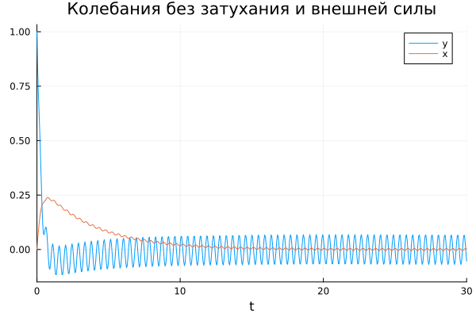{#fig:005 width=70%}

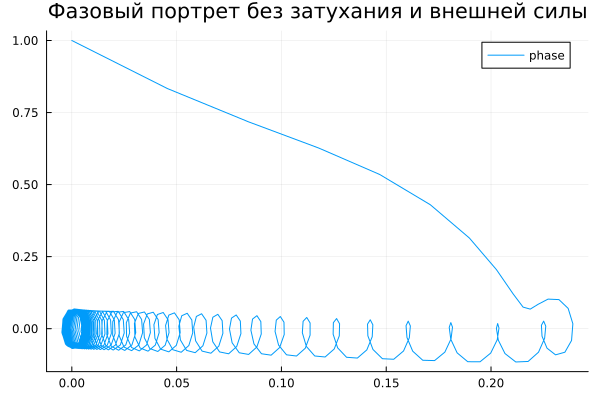{#fig:006 width=70%}

Вторым этапом было необходимо реализовать то же решение с помощью OpenModelica. Применяя следующий код:
```
model lab4
  parameter Real gamma = 2.0;
  parameter Real omega = 5.0;
  parameter Real x0 = 0.0;
  parameter Real y0 = 1.0;
  
  Real x(start = x0);
  Real y(start = y0);
equation
  der(x) = y;
  der(y) = - gamma * y - omega * x;
end lab4;
```
и изменяя параметры `gamma` и `omega` (и добавив sin(14*time) для 3-го случая), были получены следующие решения уравнений и фазовые портреты (рис. [-@fig:007], рис. [-@fig:008], рис. [-@fig:009], рис. [-@fig:010], рис. [-@fig:011], рис. [-@fig:012]):

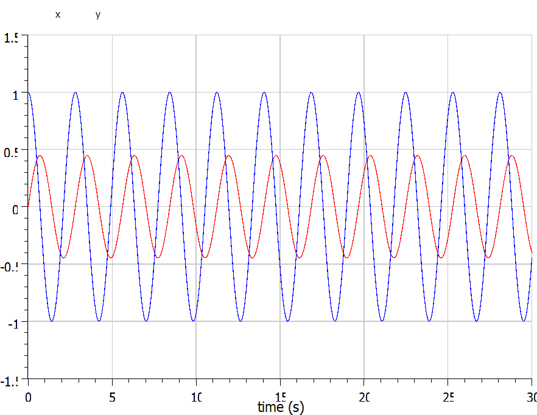{#fig:007 width=70%}

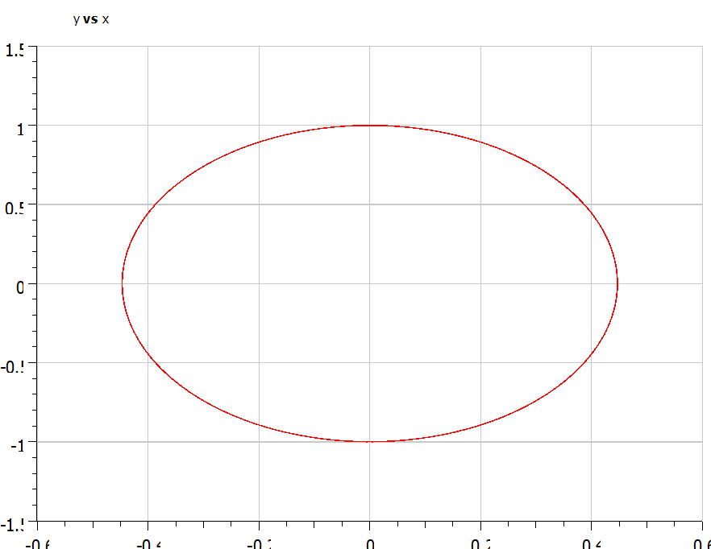{#fig:008 width=70%}

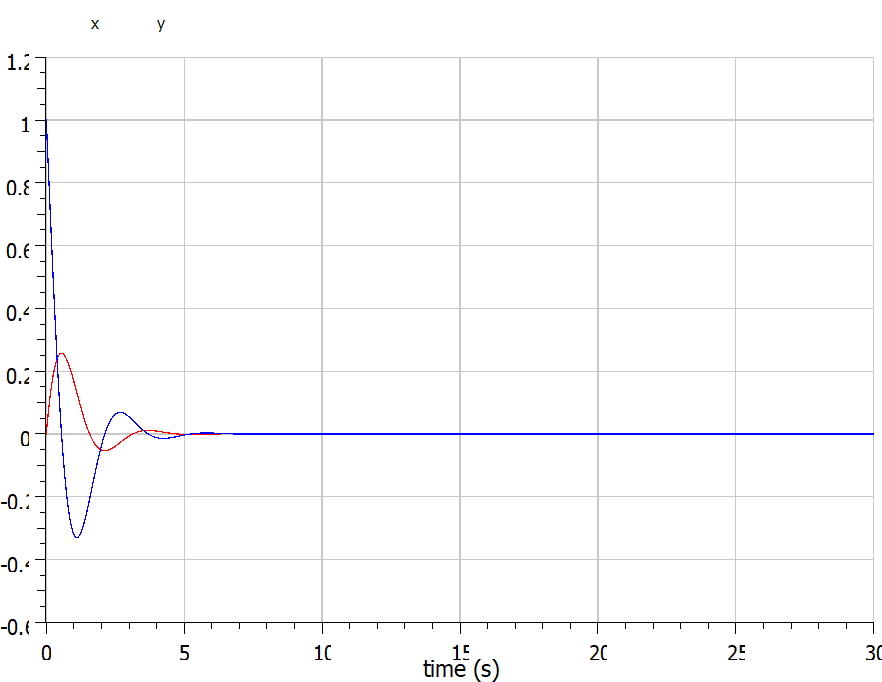{#fig:009 width=70%}

{#fig:010 width=70%}

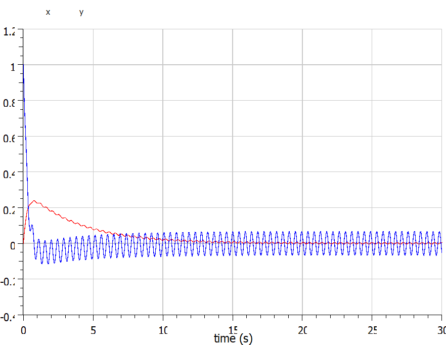{#fig:011 width=70%}

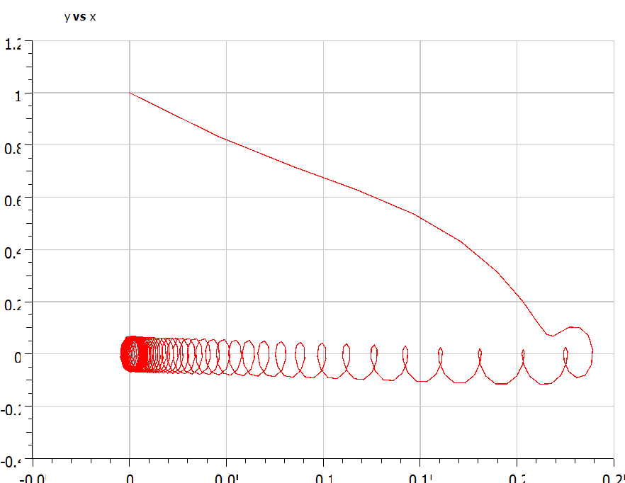{#fig:012 width=70%}

# Выводы

В ходе лабораторной работы мы смоделировали поведение линейного гармонического осциллятора с "идеальной системе", в системе с потерями энергии, а также в системе с воздействием внешних сил.

# Список литературы{.unnumbered}

::: {#refs}
:::
