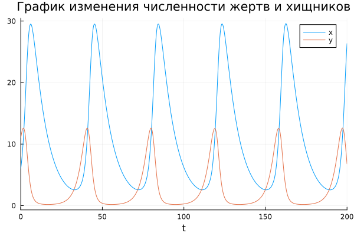

---
## Front matter
lang: ru-RU
title: Модель Лотки-Вольтерры
subtitle: Лабораторная работа №5.
author:
  - Рогожина Н.А.
institute:
  - Российский университет дружбы народов, Москва, Россия
date: 2 мая 2025

## i18n babel
babel-lang: russian
babel-otherlangs: english

## Formatting pdf
toc: false
toc-title: Содержание
slide_level: 2
aspectratio: 169
section-titles: true
theme: metropolis
header-includes:
 - \metroset{progressbar=frametitle,sectionpage=progressbar,numbering=fraction}
---

# Информация

## Докладчик

:::::::::::::: {.columns align=center}
::: {.column width="70%"}

  * Рогожина Надежда Александровна
  * студентка 3 курса НФИбд-02-22
  * Российский университет дружбы народов
  * <https://mikogreen.github.io/>

:::
::::::::::::::

# Задание

## Задание

Для модели «хищник-жертва»:

1. $\frac{dx}{dt} = -0.12x(t) + 0.041x(t)y(t)$

2. $\frac{dy}{dt} = 0.32y(t) - 0.029x(t)y(t)$

## Задание

Постройте график зависимости численности хищников от численности жертв, а также графики изменения численности хищников и численности жертв при следующих начальных условиях: $x_0 = 6, y_0 = 11$. Найдите стационарное состояние системы.

# Теоретическое введение

## Теоретическое введение

Простейшая модель взаимодействия двух видов типа «хищник — жертва» - модель Лотки-Вольтерры. Данная двувидовая модель основывается на следующих предположениях:

1. Численность популяции жертв x и хищников y зависят только от времени (модель не учитывает пространственное распределение популяции на занимаемой территории)

2. В отсутствии взаимодействия численность видов изменяется по модели Мальтуса, при этом число жертв увеличивается, а число хищников падает.

## Теоретическое введение

3. Естественная смертность жертвы и естественная рождаемость хищника считаются несущественными.

4. Эффект насыщения численности обеих популяций не учитывается.

## Теоретическое введение

5. Скорость роста численности жертв уменьшается пропорционально численности хищников
    
    - $\frac{dx}{dt} = ax(t) - bx(t)y(t)$
    
    - $\frac{dy}{dt} = -cy(t) + dx(t)y(t)$

## Теоретическое введение

В этой модели x – число жертв, y - число хищников. Коэффициент a описывает скорость естественного прироста числа жертв в отсутствие хищников, с - естественное вымирание хищников, лишенных пищи в виде жертв. Вероятность взаимодействия жертвы и хищника считается пропорциональной как количеству жертв, так и числу самих хищников (xy). Каждый акт взаимодействия уменьшает популяцию жертв, но способствует увеличению популяции хищников (члены -bxy и dxy в правой части уравнения). 

## Теоретическое введение

Стационарное состояние системы (1) (положение равновесия, не зависящее от времени решение) будет в точке: $x_0 = \frac{c}{d}, y_0 = \frac{a}{b}$. Если начальные значения задать в стационарном состоянии $x(0)=x_0, y(0)=y_0$, то в любой момент времени численность популяций изменяться не будет.

# Выполнение лабораторной работы

## Julia

Первоначально, работа была выполнена с помощью языка `Julia` в `Jupyter notebook` с помощью следующего кода:
```
using DifferentialEquations, Plots

a = -0.12
b = -0.041
c = -0.32
d = -0.029
p = [a, b, c, d]
```

## Julia

```
x0 = 6.0
y0 = 11.0
u0 = [x0, y0]
tspan=(0.0, 200.0)

function lw(u, p, t)
    a, b, c, d = p
    x, y = u
    dx = a*x - b*x*y
    dy = -c*y + d*x*y
    return [dx, dy]
end
```
## Julia

```
prob1 = ODEProblem(lw, u0, tspan, p)
sol1 = solve(prob1, Tsit5(), saveat=0.05)
plot(sol1, label=["x" "y"], title="График изменения численности жертв и хищников")
plot(sol1, idxs=(2,1), label=["phase"], title="Фазовый портрет")
```

## Julia

{#fig:001 width=70%}

## Julia

{#fig:002 width=70%}

## OpenModelica

{#fig:003 width=45%}

## OpenModelica

{#fig:004 width=70%}

## OpenModelica

{#fig:005 width=70%}

# Выводы

## Выводы 

В ходе лабораторной работы мы смоделировали поведение модели Лотки-Вольтерры, нашли стационарное состояние ($x_0 = 11.034483, y_0 = 2.9268293$), а также построили график изменения численности популяции и фазовый портрет с помощью двух инструментов - ЯП `Julia`  и `OpenModelica`.

