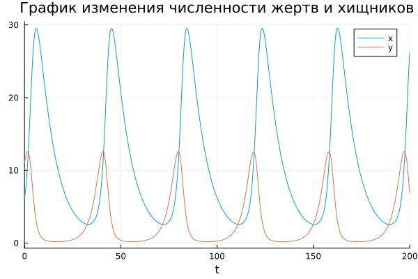
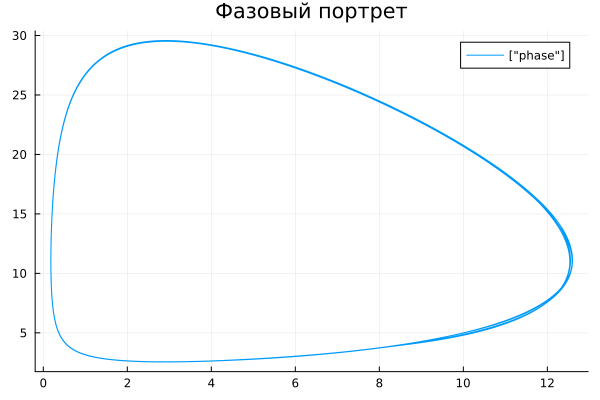
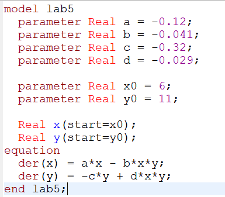
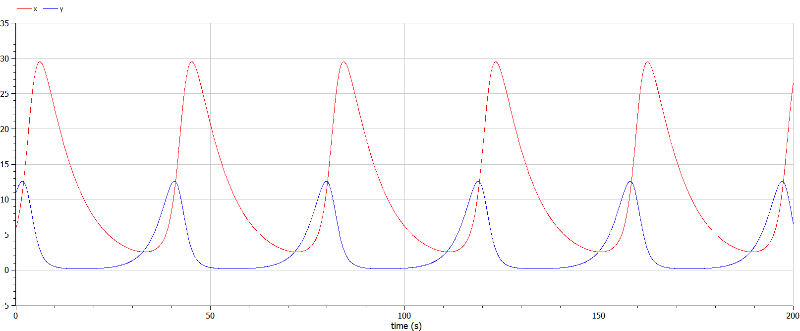
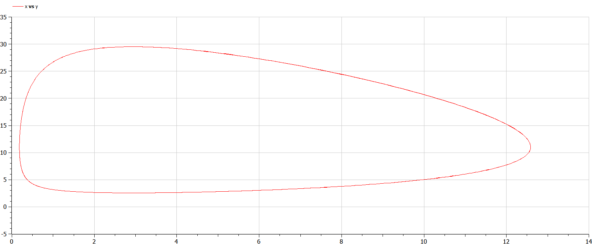

---
## Front matter
title: "Отчёт по лабораторной работе №5"
subtitle: "Модель Лотки-Вольтерры"
author: "Надежда Александровна Рогожина"

## Generic otions
lang: ru-RU
toc-title: "Содержание"

## Bibliography
bibliography: bib/cite.bib
csl: pandoc/csl/gost-r-7-0-5-2008-numeric.csl

## Pdf output format
toc: true # Table of contents
toc-depth: 2
lof: true # List of figures
lot: true # List of tables
fontsize: 12pt
linestretch: 1.5
papersize: a4
documentclass: scrreprt
## I18n polyglossia
polyglossia-lang:
  name: russian
  options:
	- spelling=modern
	- babelshorthands=true
polyglossia-otherlangs:
  name: english
## I18n babel
babel-lang: russian
babel-otherlangs: english
## Fonts
mainfont: IBM Plex Serif
romanfont: IBM Plex Serif
sansfont: IBM Plex Sans
monofont: IBM Plex Mono
mathfont: STIX Two Math
mainfontoptions: Ligatures=Common,Ligatures=TeX,Scale=0.94
romanfontoptions: Ligatures=Common,Ligatures=TeX,Scale=0.94
sansfontoptions: Ligatures=Common,Ligatures=TeX,Scale=MatchLowercase,Scale=0.94
monofontoptions: Scale=MatchLowercase,Scale=0.94,FakeStretch=0.9
mathfontoptions:
## Biblatex
biblatex: true
biblio-style: "gost-numeric"
biblatexoptions:
  - parentracker=true
  - backend=biber
  - hyperref=auto
  - language=auto
  - autolang=other*
  - citestyle=gost-numeric
## Pandoc-crossref LaTeX customization
figureTitle: "Рис."
tableTitle: "Таблица"
listingTitle: "Листинг"
lofTitle: "Список иллюстраций"
lotTitle: "Список таблиц"
lolTitle: "Листинги"
## Misc options
indent: true
header-includes:
  - \usepackage{indentfirst}
  - \usepackage{float} # keep figures where there are in the text
  - \floatplacement{figure}{H} # keep figures where there are in the text
---

# Задание

Для модели «хищник-жертва»:

1. $\frac{dx}{dt} = -0.12x(t) + 0.041x(t)y(t)$
2. $\frac{dy}{dt} = 0.32y(t) - 0.029x(t)y(t)$

Постройте график зависимости численности хищников от численности жертв, а также графики изменения численности хищников и численности жертв при следующих начальных условиях: $x_0 = 6, y_0 = 11$. Найдите стационарное состояние системы.


# Теоретическое введение

Простейшая модель взаимодействия двух видов типа «хищник — жертва» - модель Лотки-Вольтерры. Данная двувидовая модель основывается на следующих предположениях:

1. Численность популяции жертв x и хищников y зависят только от времени (модель не учитывает пространственное распределение популяции на занимаемой территории)

2. В отсутствии взаимодействия численность видов изменяется по модели Мальтуса, при этом число жертв увеличивается, а число хищников падает.

3. Естественная смертность жертвы и естественная рождаемость хищника считаются несущественными.

4. Эффект насыщения численности обеих популяций не учитывается.

5. Скорость роста численности жертв уменьшается пропорционально численности хищников
    - $\frac{dx}{dt} = ax(t) - bx(t)y(t)$
    - $\frac{dy}{dt} = -cy(t) + dx(t)y(t)$

В этой модели x – число жертв, y - число хищников. Коэффициент a описывает скорость естественного прироста числа жертв в отсутствие хищников, с - естественное вымирание хищников, лишенных пищи в виде жертв. Вероятность взаимодействия жертвы и хищника считается пропорциональной как количеству жертв, так и числу самих хищников (xy). Каждый акт взаимодействия уменьшает популяцию жертв, но способствует увеличению популяции хищников (члены -bxy и dxy в правой части уравнения). 

Стационарное состояние системы (положение равновесия, не зависящее от времени решение) будет в точке: $x_0 = \frac{c}{d}, y_0 = \frac{a}{b}$. Если начальные значения задать в стационарном состоянии $x(0)=x_0, y(0)=y_0$, то в любой момент времени численность популяций изменяться не будет.

# Выполнение лабораторной работы

Первоначально, работа была выполнена с помощью языка `Julia` в `Jupyter notebook` с помощью следующего кода:
```
using DifferentialEquations, Plots

a = -0.12
b = -0.041
c = -0.32
d = -0.029
p = [a, b, c, d]
x0 = 6.0
y0 = 11.0
u0 = [x0, y0]
tspan=(0.0, 200.0)

function lw(u, p, t)
    a, b, c, d = p
    x, y = u
    dx = a*x - b*x*y
    dy = -c*y + d*x*y
    return [dx, dy]
end
prob1 = ODEProblem(lw, u0, tspan, p)
sol1 = solve(prob1, Tsit5(), saveat=0.05)
plot(sol1, label=["x" "y"], title="График изменения численности жертв и хищников")
plot(sol1, idxs=(2,1), label=["phase"], title="Фазовый портрет")
```

В результате были получены следующие решения уравнений и фазовые портреты (рис. [-@fig:001], рис. [-@fig:002]):

{#fig:001 width=70%}

{#fig:002 width=70%}

Вторым этапом было необходимо реализовать то же решение с помощью OpenModelica. Применяя следующий код (рис. [-@fig:003]), были получены следующие результаты (рис. [-@fig:004], рис. [-@fig:005])

{#fig:003 width=70%}

{#fig:004 width=70%}

{#fig:005 width=70%}

# Выводы

В ходе лабораторной работы мы смоделировали поведение модели Лотки-Вольтерры, нашли стационарное состояние ($x_0 = 11.034483, y_0 = 2.9268293$), а также построили график изменения численности популяции и фазовый портрет с помощью двух инструментов - ЯП `Julia`  и `OpenModelica`.

# Список литературы{.unnumbered}

::: {#refs}
:::
