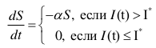
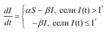
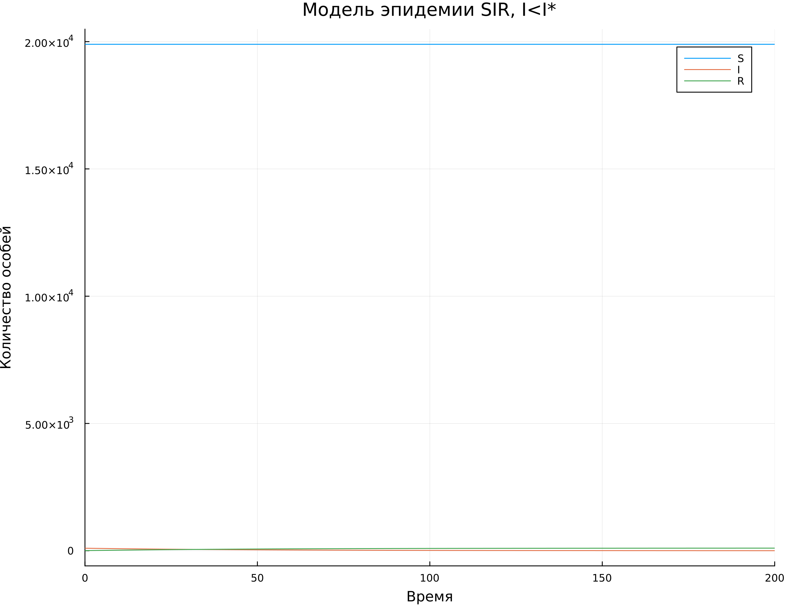
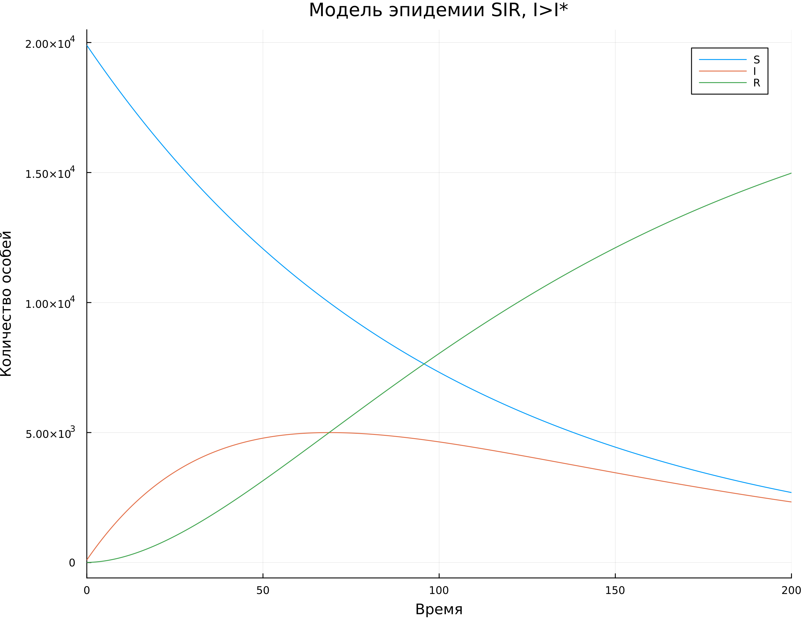
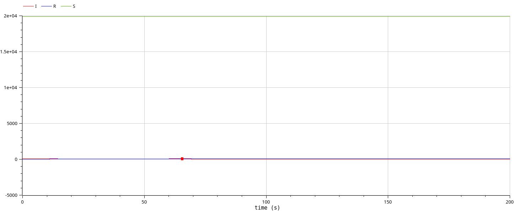
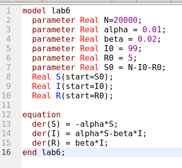
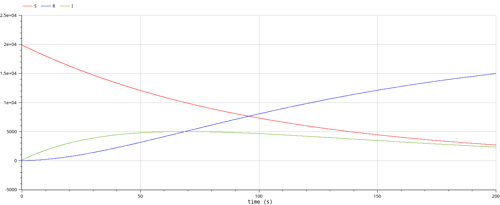

---
## Front matter
lang: ru-RU
title: Модель эпидемии SIR.
subtitle: Лабораторная работа №6.
author:
  - Рогожина Н.А.
institute:
  - Российский университет дружбы народов, Москва, Россия
date: 3 мая 2025

## i18n babel
babel-lang: russian
babel-otherlangs: english

## Formatting pdf
toc: false
toc-title: Содержание
slide_level: 2
aspectratio: 169
section-titles: true
theme: metropolis
header-includes:
 - \metroset{progressbar=frametitle,sectionpage=progressbar,numbering=fraction}
---

# Информация

## Докладчик

:::::::::::::: {.columns align=center}
::: {.column width="70%"}

  * Рогожина Надежда Александровна
  * студентка 3 курса НФИбд-02-22
  * Российский университет дружбы народов
  * <https://mikogreen.github.io/>

:::
::::::::::::::

# Задание

## Задание

Рассмотрим простейшую модель эпидемии. Предположим, что некая популяция, состоящая из N особей, (считаем, что популяция изолирована) подразделяется на три группы. 
1. Первая группа - это восприимчивые к болезни, но пока здоровые особи, обозначим их через S(t).
2. Вторая группа – это число инфицированных особей, которые также при этом являются распространителями
инфекции, обозначим их I(t). 
3. А третья группа, обозначающаяся через R(t) – это здоровые особи с иммунитетом к болезни.

До того, как число заболевших не превышает критического значения I* , считаем, что все больные изолированы и не заражают здоровых. Когда I(t) > I*, тогда инфицирование способны заражать восприимчивых к болезни особей.

# Теоретическое введение

## Теоретическое введение

Скорость изменения числа S(t) меняется по следующему закону:

{#fig:001 width=70%}

## Теоретическое введение

Поскольку каждая восприимчивая к болезни особь, которая, в конце концов, заболевает, сама становится инфекционной, то скорость изменения числа инфекционных особей представляет разность за единицу времени между заразившимися и теми, кто уже болеет и лечится, т.е.:

{#fig:002 width=70%}

## Теоретическое введение

А скорость изменения выздоравливающих особей (при этом приобретающие иммунитет к болезни) остается одинковой в обоих случаях - $\beta * I$.

Постоянные пропорциональности $\alpha$,$\beta$ - это коэффициенты заболеваемости и выздоровления соответственно.

# Выполнение 

## Код Julia

Используя `Jupyter Notebook`, напишем следующий код для реализации модели:
```
N = 20000
t = 0
I0 = 99
R0 = 5
S0 = N - I0 - R0
alpha = 0.01
beta = 0.02
u0 = [S0, I0, R0]
p = [alpha, beta]
tspan = (0.0, 200.0)
```

## Код Julia

```
using Plots
using DifferentialEquations

# I0 < I*
function sir(u,p,t)
    (S,I,R) = u
    (alpha, beta) = p
    N = S+I+R
    dS = 0
    dI = -beta*I
    dR = beta*I
    return [dS, dI, dR]
end
```

## Код Julia


```
# I0 > I*
function sir2(u,p,t)
    (S,I,R) = u
    (alpha, beta) = p
    N = S+I+R
    dS = -alpha*S
    dI = alpha*S - beta*I
    dR = beta*I
    return [dS, dI, dR]
end
```

## Визуализация результатов

Визуализировав результаты вычисления (функций `ODEProblem` и `solve`), получили следующие результаты:

## Визуализация результатов

{#fig:003 width=60%}

## Визуализация результатов

{#fig:004 width=60%}

## Второй этап

Второй этап работы - проделать те же действия в OpenModelica. Для первого случая (I0<=I*) был реализован следующий код:

{#fig:005 width=45%}

## I<=I*

И был получен следующий результат:

{#fig:006 width=70%}

## I>I*

Для второго случая (I0>I*) также был реализован код:

{#fig:007 width=45%}

## I>I*

И визуализирован результат:

{#fig:008 width=70%}

# Выводы

## Выводы

В ходе работы мы смоделировали модель эпидемии SIR с помощью языка программирования `Julia` и средства `OpenModelica` и получили одинаковый результат.

