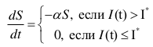
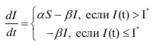
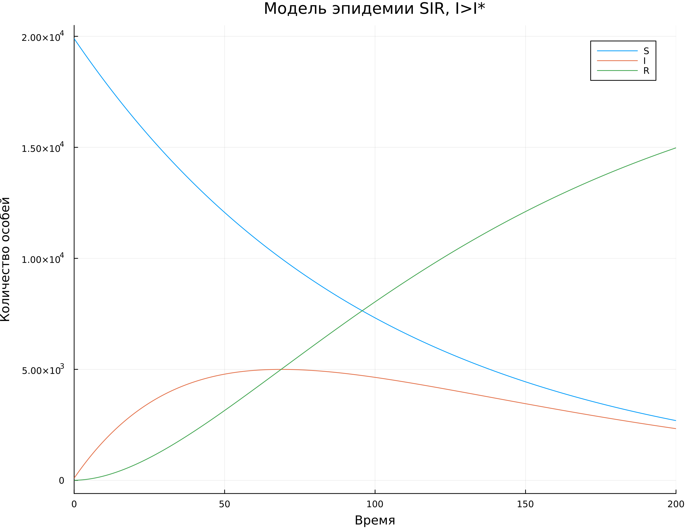
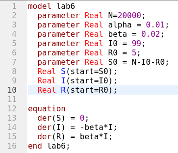
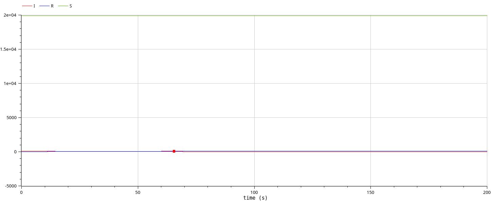
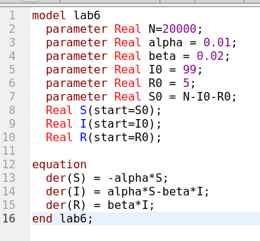
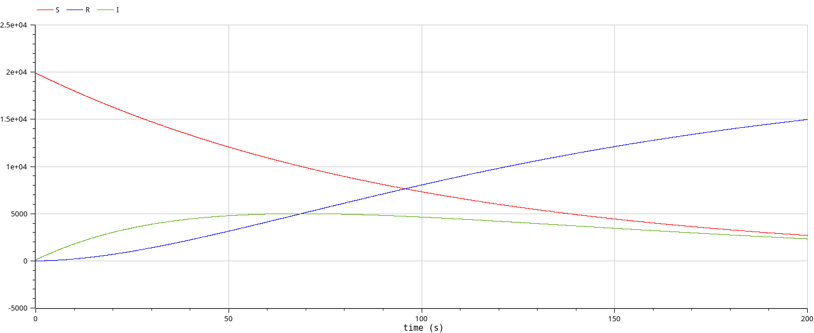

---
## Front matter
title: "Отчёт по лабораторной работе №6"
subtitle: "Модель эпидемии SIR"
author: "Надежда Александровна Рогожина"

## Generic otions
lang: ru-RU
toc-title: "Содержание"

## Bibliography
bibliography: bib/cite.bib
csl: pandoc/csl/gost-r-7-0-5-2008-numeric.csl

## Pdf output format
toc: true # Table of contents
toc-depth: 2
lof: true # List of figures
lot: true # List of tables
fontsize: 12pt
linestretch: 1.5
papersize: a4
documentclass: scrreprt
## I18n polyglossia
polyglossia-lang:
  name: russian
  options:
	- spelling=modern
	- babelshorthands=true
polyglossia-otherlangs:
  name: english
## I18n babel
babel-lang: russian
babel-otherlangs: english
## Fonts
mainfont: IBM Plex Serif
romanfont: IBM Plex Serif
sansfont: IBM Plex Sans
monofont: IBM Plex Mono
mathfont: STIX Two Math
mainfontoptions: Ligatures=Common,Ligatures=TeX,Scale=0.94
romanfontoptions: Ligatures=Common,Ligatures=TeX,Scale=0.94
sansfontoptions: Ligatures=Common,Ligatures=TeX,Scale=MatchLowercase,Scale=0.94
monofontoptions: Scale=MatchLowercase,Scale=0.94,FakeStretch=0.9
mathfontoptions:
## Biblatex
biblatex: true
biblio-style: "gost-numeric"
biblatexoptions:
  - parentracker=true
  - backend=biber
  - hyperref=auto
  - language=auto
  - autolang=other*
  - citestyle=gost-numeric
## Pandoc-crossref LaTeX customization
figureTitle: "Рис."
tableTitle: "Таблица"
listingTitle: "Листинг"
lofTitle: "Список иллюстраций"
lotTitle: "Список таблиц"
lolTitle: "Листинги"
## Misc options
indent: true
header-includes:
  - \usepackage{indentfirst}
  - \usepackage{float} # keep figures where there are in the text
  - \floatplacement{figure}{H} # keep figures where there are in the text
---

# Задание

Рассмотрим простейшую модель эпидемии. Предположим, что некая популяция, состоящая из N особей, (считаем, что популяция изолирована) подразделяется на три группы. 
1. Первая группа - это восприимчивые к болезни, но пока здоровые особи, обозначим их через S(t).
2. Вторая группа – это число инфицированных особей, которые также при этом являются распространителями
инфекции, обозначим их I(t). 
3. А третья группа, обозначающаяся через R(t) – это здоровые особи с иммунитетом к болезни.

До того, как число заболевших не превышает критического значения I* , считаем, что все больные изолированы и не заражают здоровых. Когда I(t) > I*, тогда инфицирование способны заражать восприимчивых к болезни особей.

# Теоретическое введение

Скорость изменения числа S(t) меняется по следующему закону (рис. [-@fig:001]):

{#fig:001 width=70%}

Поскольку каждая восприимчивая к болезни особь, которая, в конце концов, заболевает, сама становится инфекционной, то скорость изменения числа инфекционных особей представляет разность за единицу времени между заразившимися и теми, кто уже болеет и лечится, т.е. (рис. [-@fig:002]):

{#fig:002 width=70%}

А скорость изменения выздоравливающих особей (при этом приобретающие иммунитет к болезни) остается одинковой в обоих случаях - $\beta * I$.

Постоянные пропорциональности $\alpha$,$\beta$ - это коэффициенты заболеваемости и выздоровления соответственно.


# Выполнение лабораторной работы

Используя `Jupyter Notebook`, напишем следующий код для реализации модели:
```
N = 20000
t = 0
I0 = 99
R0 = 5
S0 = N - I0 - R0
alpha = 0.01
beta = 0.02
u0 = [S0, I0, R0]
p = [alpha, beta]
tspan = (0.0, 200.0)

using Plots
using DifferentialEquations

# I0 < I*
function sir(u,p,t)
    (S,I,R) = u
    (alpha, beta) = p
    N = S+I+R
    dS = 0
    dI = -beta*I
    dR = beta*I
    return [dS, dI, dR]
end

# I0 > I*
function sir2(u,p,t)
    (S,I,R) = u
    (alpha, beta) = p
    N = S+I+R
    dS = -alpha*S
    dI = alpha*S - beta*I
    dR = beta*I
    return [dS, dI, dR]
end
```

Здесь приведены 2 ветки:
- при I0<=I*
- при I0>I*

Визуализировав результаты вычисления (функций `ODEProblem` и `solve`), получили следующие результаты (рис. [-@fig:003], рис. [-@fig:004]):

{#fig:003 width=70%}

{#fig:004 width=70%}

Второй этап работы - проделать те же действия в OpenModelica. Для первого случая (I0<=I*) был реализован следующий код (рис. [-@fig:005]):

{#fig:005 width=70%}

И был получен следующий результат (рис. [-@fig:006]):

{#fig:006 width=70%}

Для второго случая (I0>I*) также был реализован код (рис. [-@fig:007]):

{#fig:007 width=70%}

И визуализирован результат (рис. [-@fig:008]):

{#fig:008 width=70%}

# Выводы

В ходе работы мы смоделировали модель эпидемии SIR с помощью языка программирования `Julia` и средства `OpenModelica` и получили одинаковый результат.

# Список литературы{.unnumbered}

::: {#refs}
:::
