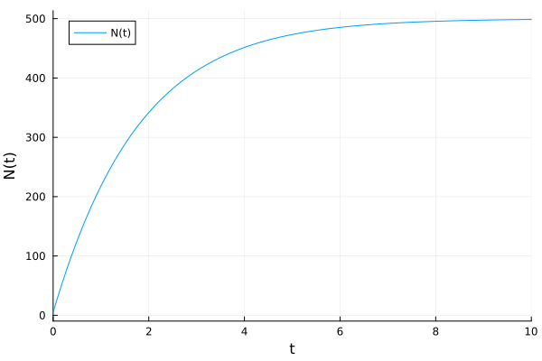
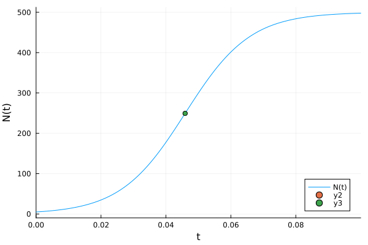
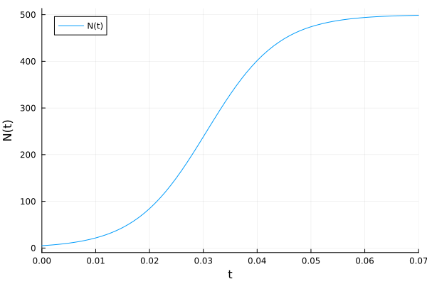
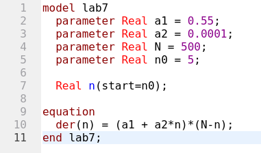
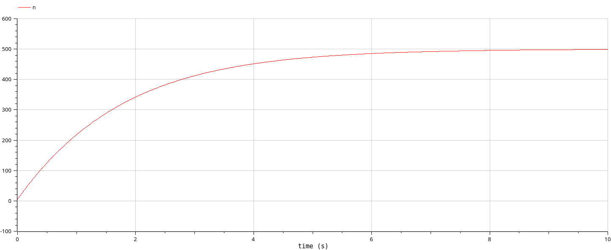
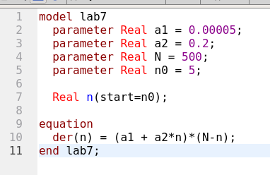
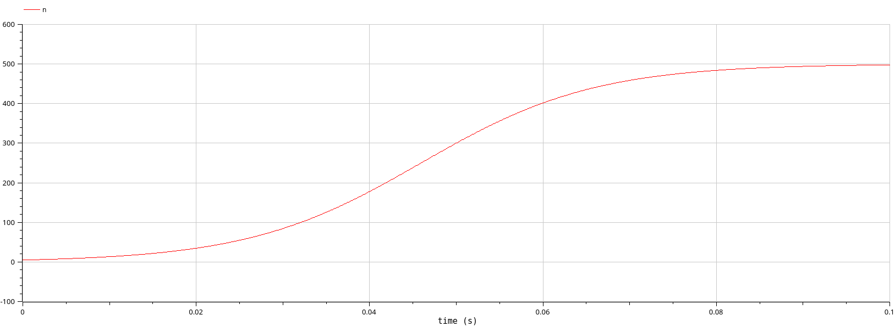
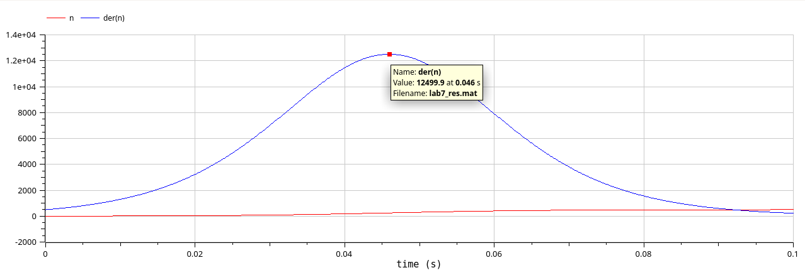
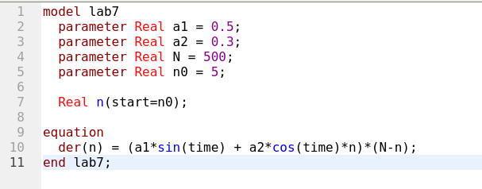
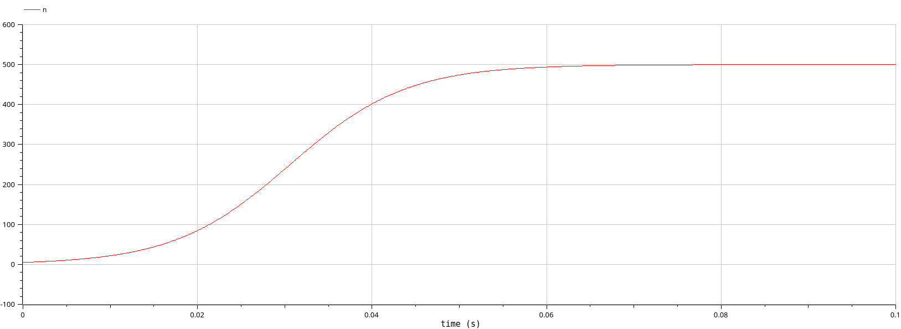

---
## Front matter
lang: ru-RU
title: Исследование эффективности рекламы.
subtitle: Лабораторная работа №7.
author:
  - Рогожина Н.А.
institute:
  - Российский университет дружбы народов, Москва, Россия
date: 3 мая 2025

## i18n babel
babel-lang: russian
babel-otherlangs: english

## Formatting pdf
toc: false
toc-title: Содержание
slide_level: 2
aspectratio: 169
section-titles: true
theme: metropolis
header-includes:
 - \metroset{progressbar=frametitle,sectionpage=progressbar,numbering=fraction}
---

# Информация

## Докладчик

:::::::::::::: {.columns align=center}
::: {.column width="70%"}

  * Рогожина Надежда Александровна
  * студентка 3 курса НФИбд-02-22
  * Российский университет дружбы народов
  * <https://mikogreen.github.io/>

:::
::::::::::::::

# Задание

## Задание

29 января в городе открылся новый салон красоты. Полагаем, что на момент открытия о салоне знали N 0
потенциальных клиентов. По маркетинговым исследованиям известно, что в районе проживают N потенциальных клиентов салона. Поэтому после открытия салона руководитель запускает активную рекламную компанию. После этого скорость изменения числа знающих о салоне пропорциональна как числу знающих о нем, так и числу не знаю о нем.

## Задание

Постройте график распространения рекламы, математическая модель которой описывается
следующим уравнением:
1. $\frac{dn}{dt} = (0.55 + 0.0001 n(t))(N-n(t))$

2. $\frac{dn}{dt} = (0.00005 + 0.2 n(t))(N-n(t))$

3. $\frac{dn}{dt} = (0.5 sin(t) + 0.3 cos(t) n(t))(N-n(t))$

При этом объем аудитории N=500, в начальный момент о товаре знает 5 человек. Для случая 2 определите в какой момент времени скорость распространения рекламы будет иметь максимальное значение.

# Теоретическое введение

## Теоретическое введение

Организуется рекламная кампания нового товара или услуги. Необходимо, чтобы прибыль будущих продаж с избытком покрывала издержки на рекламу. Вначале расходы могут превышать прибыль, поскольку лишь малая часть потенциальных покупателей будет информирована о новинке. Затем, при увеличении числа продаж, возрастает и прибыль, и, наконец, наступит момент, когда рынок насытиться, и рекламировать товар станет бесполезным.

## Теоретическое введение

Предположим, что торговыми учреждениями реализуется некоторая продукция, о которой в момент времени t из числа потенциальных покупателей N знает лишь n покупателей. Для ускорения сбыта продукции запускается реклама по радио, телевидению и других средств массовой информации. После запуска рекламной кампании информация о продукции начнет распространяться среди потенциальных покупателей путем общения друг с другом. Таким образом, после запуска рекламных объявлений скорость изменения числа знающих о продукции людей пропорциональна как числу знающих о товаре покупателей, так и числу покупателей о нем не знающих.

# Выполнение 

## Код Julia

Используя этот код:
```
using DifferentialEquations, Plots


N = 500
n0 = 5
f(n,p,t) = (p[1]+p[2]*n)*(N - n)
ff(n,p,t) = (p[1]*sin(t)+p[2]*cos(t)*n)*(N-n)
p1 = [0.55, 0.0001]
tspan1 = (0.0, 10.0)
prob1 = ODEProblem(f, n0, tspan1, p1)
```
## Код Julia
```
sol1 = solve(prob1, Tsit5(), saveat=0.01)
plot(sol1, markersize =:15, yaxis="N(t)",  label="N(t)")
```
и его немного измененные версии (где изменялись коэффициенты), получилось построить 3 графика распространения рекламы, включая отмеченную точку наибольшей скорости распространения рекламы (через нахождение значения скорости в определенной точке времени), которая была найдена на моменте времени t=460.

## Первая функция

{#fig:001 width=70%}

## Вторая функция

{#fig:002 width=70%}

## Третья функция

{#fig:003 width=70%}

## Второй этап

Также, была смоделирована та же модель с помощью `OpenModelica`.

## Первая функция

{#fig:004 width=70%}

## Первая функция

{#fig:005 width=70%}

## Вторая функция

{#fig:006 width=70%}

## Вторая функция

{#fig:007 width=70%}

## Вторая функция

{#fig:008 width=70%}

## Третья функция

{#fig:009 width=70%}

## Третья функция

{#fig:010 width=70%}

# Выводы

## Выводы

В ходе лабораторной работы было смоделировано поведение рекламы с помощью 2-х средств: `Julia` и `OpenModelica`.

