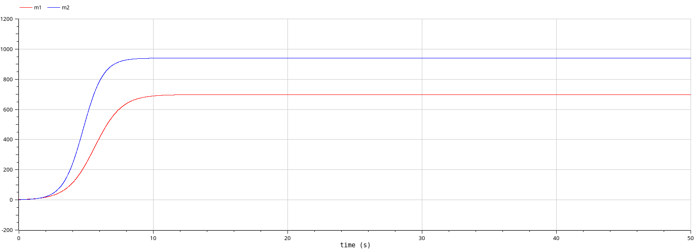

---
## Front matter
lang: ru-RU
title: Модель конкуренции двух фирм.
subtitle: Лабораторная работа №8.
author:
  - Рогожина Н.А.
institute:
  - Российский университет дружбы народов, Москва, Россия
date: 5 мая 2025

## i18n babel
babel-lang: russian
babel-otherlangs: english

## Formatting pdf
toc: false
toc-title: Содержание
slide_level: 2
aspectratio: 169
section-titles: true
theme: metropolis
header-includes:
 - \metroset{progressbar=frametitle,sectionpage=progressbar,numbering=fraction}
---

# Информация

## Докладчик

:::::::::::::: {.columns align=center}
::: {.column width="70%"}

  * Рогожина Надежда Александровна
  * студентка 3 курса НФИбд-02-22
  * Российский университет дружбы народов
  * <https://mikogreen.github.io/>

:::
::::::::::::::

# Задание

## Задание

Необходимо рассмотреть 2 случая:

1. Случай 1. Рассмотрим две фирмы, производящие взаимозаменяемые товары одинакового качества и находящиеся в одной рыночной нише. Считаем, что в рамках нашей модели конкурентная борьба ведётся только рыночными методами. То есть, конкуренты могут влиять на противника путем изменения параметров своего производства: себестоимость, время цикла, но не могут прямо вмешиваться в ситуацию на рынке («назначать» цену или влиять на потребителей каким-либо иным способом.) Будем считать, что постоянные издержки пренебрежимо малы, и в модели учитывать не будем.

## Задание

2. Случай 2. Рассмотрим модель, когда, помимо экономического фактора влияния (изменение себестоимости, производственного цикла, использование кредита и т.п.), используются еще и социально-психологические факторы – формирование общественного предпочтения одного товара другому, не зависимо от их качества и цены. В этом случае взаимодействие двух фирм будет зависеть друг от друга, соответственно коэффициент перед M 1 M 2 будет отличаться.

# Теоретическое введение

## Теоретическое введение

В первом случае, динамика изменения объемов продаж фирмы 1 и фирмы 2 описывается следующей системой уравнений:

{#fig:001 width=70%}

## Теоретическое введение

Во втором случае, в рамках рассматриваемой модели динамика изменения объемов продаж фирмы 1 и фирмы 2 описывается следующей системой уравнений:

{#fig:002 width=70%}

## Теоретическое введение

В обоих случаях, начальные условия следующие:

{#fig:003 width=70%}

# Выполнение 

## Код Julia

```
using DifferentialEquations, Plots


function f1(u,p,t)
    m1, m2 = u
    a1, a2, b, c1, c2 = p
    m1 = m1 - (b/c1) * m1 * m2 - (a1/c1) * m1^2 
    m2 = (c2/c1) * m2 - (b/c1) * m1 * m2 - (a2/c1) * m2^2
    return [m1, m2]
end
```

## Код Julia

```
function f2(u,p,t)
    m1, m2 = u
    a1, a2, b, c1, c2 = p
    m1 = m1 - (b/c1+0.001)*m1*m2 - (a1/c1)*m1^2 
    m2 = (c2/c1)*m2 - (b/c1)*m1*m2 - (a2/c1)*m2^2
    return [m1, m2]
end
```

## Случай 1, Julia

{#fig:004 width=70%}

## Случай 2, Julia

{#fig:005 width=70%}

## Второй этап

Также, была смоделирована та же модель с помощью `OpenModelica`.

## Случай 1, Openmodelica

{#fig:006 width=70%}

## Случай 1, Openmodelica

{#fig:007 width=70%}

## Случай 2, Openmodelica

{#fig:008 width=70%}

## Случай 2, Openmodelica

{#fig:009 width=70%}

# Выводы

## Выводы

В ходе лабораторной работы были рассмотрены 2 случая конкуренции двух фирм (с влиянием социально-психологических факторов и без) с помощью 2-х инструментов - ЯП `Julia` и `OpenModelica`. Результаты получились одинаковые.

