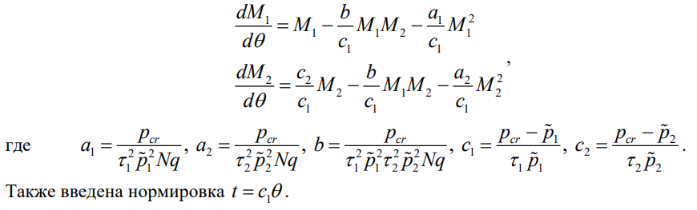
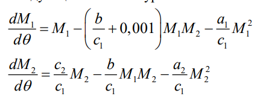
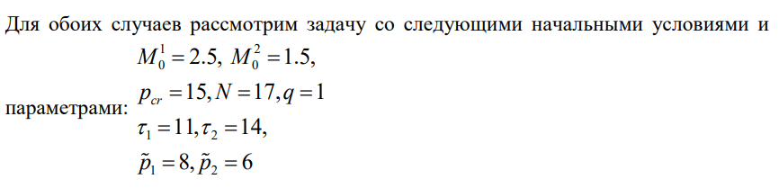
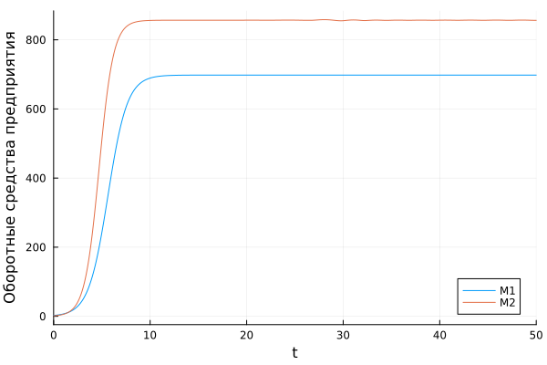
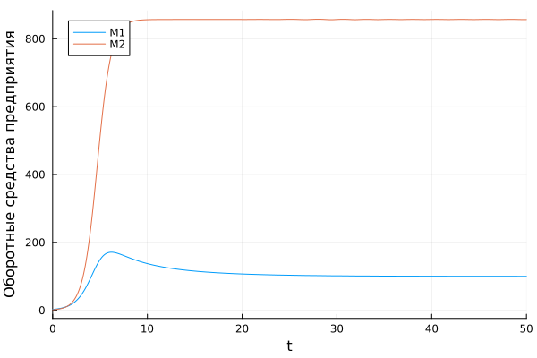
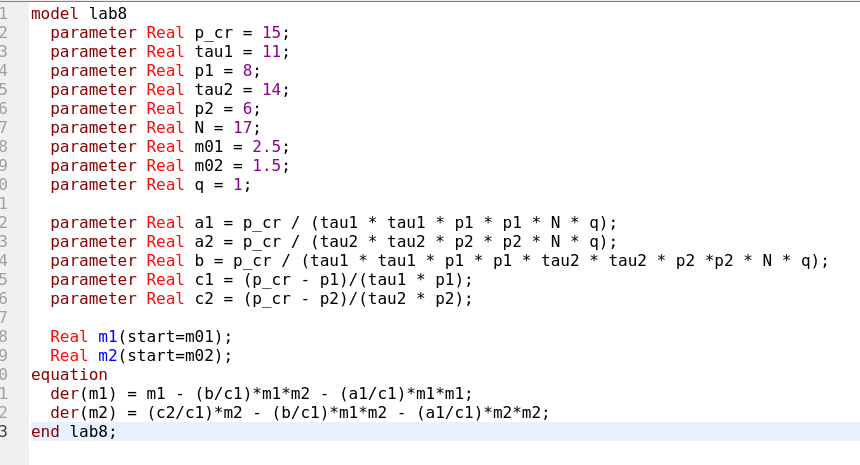
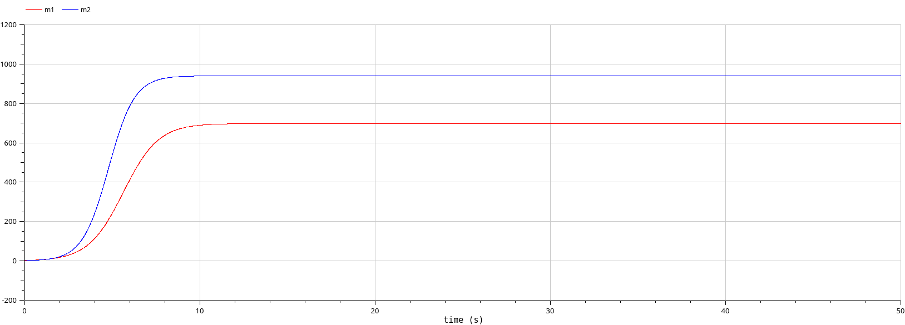
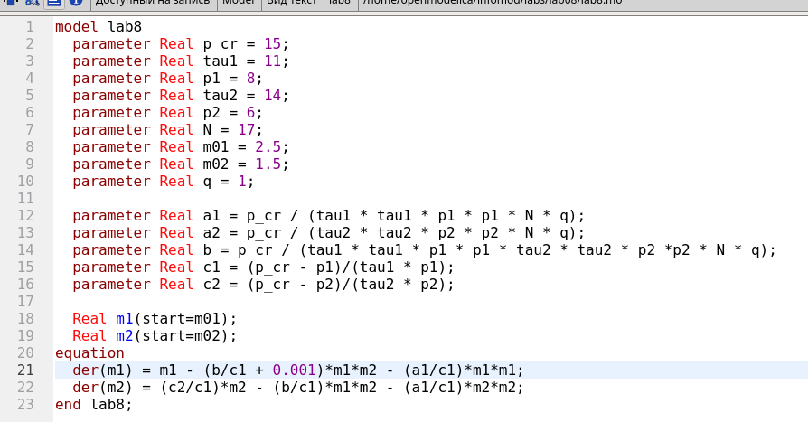
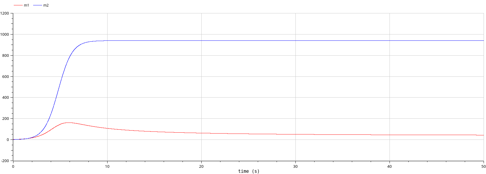

---
## Front matter
title: "Отчёт по лабораторной работе №8"
subtitle: "Модель конкуренции двух фирм"
author: "Надежда Александровна Рогожина"

## Generic otions
lang: ru-RU
toc-title: "Содержание"

## Bibliography
bibliography: bib/cite.bib
csl: pandoc/csl/gost-r-7-0-5-2008-numeric.csl

## Pdf output format
toc: true # Table of contents
toc-depth: 2
lof: true # List of figures
lot: true # List of tables
fontsize: 12pt
linestretch: 1.5
papersize: a4
documentclass: scrreprt
## I18n polyglossia
polyglossia-lang:
  name: russian
  options:
	- spelling=modern
	- babelshorthands=true
polyglossia-otherlangs:
  name: english
## I18n babel
babel-lang: russian
babel-otherlangs: english
## Fonts
mainfont: IBM Plex Serif
romanfont: IBM Plex Serif
sansfont: IBM Plex Sans
monofont: IBM Plex Mono
mathfont: STIX Two Math
mainfontoptions: Ligatures=Common,Ligatures=TeX,Scale=0.94
romanfontoptions: Ligatures=Common,Ligatures=TeX,Scale=0.94
sansfontoptions: Ligatures=Common,Ligatures=TeX,Scale=MatchLowercase,Scale=0.94
monofontoptions: Scale=MatchLowercase,Scale=0.94,FakeStretch=0.9
mathfontoptions:
## Biblatex
biblatex: true
biblio-style: "gost-numeric"
biblatexoptions:
  - parentracker=true
  - backend=biber
  - hyperref=auto
  - language=auto
  - autolang=other*
  - citestyle=gost-numeric
## Pandoc-crossref LaTeX customization
figureTitle: "Рис."
tableTitle: "Таблица"
listingTitle: "Листинг"
lofTitle: "Список иллюстраций"
lotTitle: "Список таблиц"
lolTitle: "Листинги"
## Misc options
indent: true
header-includes:
  - \usepackage{indentfirst}
  - \usepackage{float} # keep figures where there are in the text
  - \floatplacement{figure}{H} # keep figures where there are in the text
---

# Задание

Необходимо рассмотреть 2 случая:

1. Случай 1. Рассмотрим две фирмы, производящие взаимозаменяемые товары одинакового качества и находящиеся в одной рыночной нише. Считаем, что в рамках нашей модели конкурентная борьба ведётся только рыночными методами. То есть, конкуренты могут влиять на противника путем изменения параметров своего производства: себестоимость, время цикла, но не могут прямо вмешиваться в ситуацию на рынке («назначать» цену или влиять на потребителей каким-либо иным способом.) Будем считать, что постоянные издержки пренебрежимо малы, и в модели учитывать не будем.

2. Случай 2. Рассмотрим модель, когда, помимо экономического фактора влияния (изменение себестоимости, производственного цикла, использование кредита и т.п.), используются еще и социально-психологические факторы – формирование общественного предпочтения одного товара другому, не зависимо от их качества и цены. В этом случае взаимодействие двух фирм будет зависеть друг от друга, соответственно коэффициент перед M 1 M 2 будет отличаться.

# Теоретическое введение

В первом случае, динамика изменения объемов продаж фирмы 1 и фирмы 2 описывается следующей системой уравнений (рис. [-@fig:001]):

{#fig:001 width=70%}

Во втором случае, в рамках рассматриваемой модели динамика изменения объемов продаж фирмы 1 и фирмы 2 описывается следующей системой уравнений (рис. [-@fig:002]):

{#fig:002 width=70%}

В обоих случаях, начальные условия следующие (рис. [-@fig:003]):

{#fig:003 width=70%}

# Выполнение лабораторной работы

В ходе работы, оба случая были рассмотрены с помощью 2-х функций на языке `Julia`:

```
function f1(u,p,t)
    m1, m2 = u
    a1, a2, b, c1, c2 = p
    m1 = m1 - (b/c1) * m1 * m2 - (a1/c1) * m1^2 
    m2 = (c2/c1) * m2 - (b/c1) * m1 * m2 - (a2/c1) * m2^2
    return [m1, m2]
end

function f2(u,p,t)
    m1, m2 = u
    a1, a2, b, c1, c2 = p
    m1 = m1 - (b/c1+0.001)*m1*m2 - (a1/c1)*m1^2 
    m2 = (c2/c1)*m2 - (b/c1)*m1*m2 - (a2/c1)*m2^2
    return [m1, m2]
end
```

Далее, были сформированы графики для случая 1 (рис. [-@fig:004]), и случая 2 (рис. [-@fig:005]):

{#fig:004 width=70%}

{#fig:005 width=70%}

Следующей задачей становилось повторить те же действия через `OpenModelica` (рис. [-@fig:006], рис. [-@fig:007], рис. [-@fig:008], рис. [-@fig:009]):

{#fig:006 width=70%}

{#fig:007 width=70%}

{#fig:008 width=70%}

{#fig:009 width=70%}

# Выводы

В ходе лабораторной работы были рассмотрены 2 случая конкуренции двух фирм (с влиянием социально-психологических факторов и без) с помощью 2-х инструментов - ЯП `Julia` и `OpenModelica`. Результаты получились одинаковые.

# Список литературы{.unnumbered}

::: {#refs}
:::
