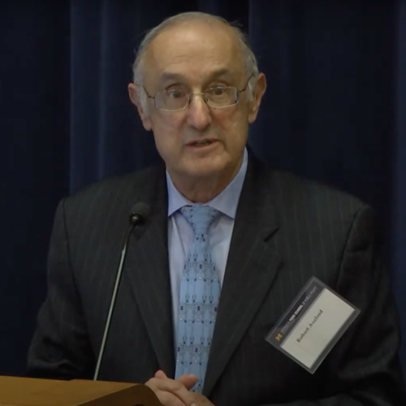
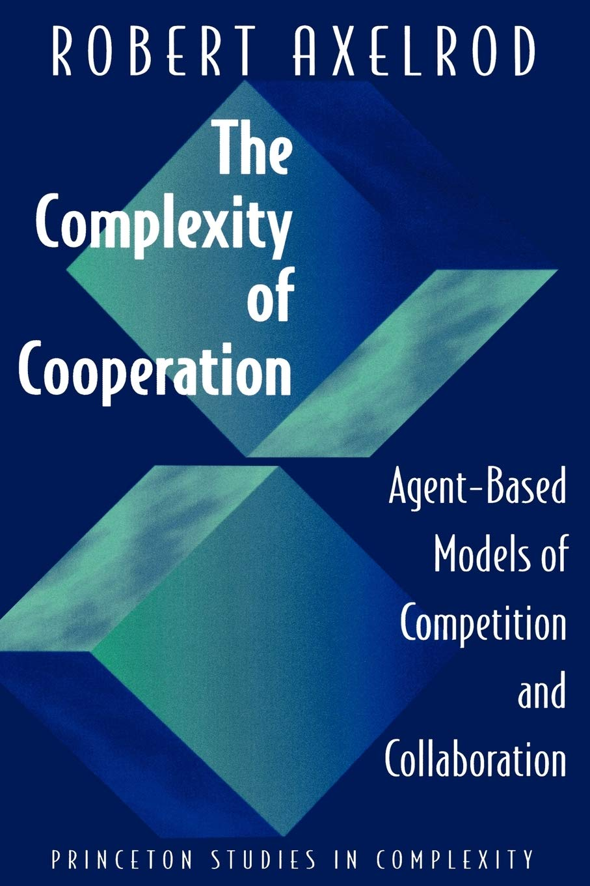

---
## Front matter
lang: ru-RU
title: Модель культуры Аксельрода.
subtitle: Доклад
author:
  - Рогожина Н.А.
institute:
  - Российский университет дружбы народов, Москва, Россия
date: 2 мая 2025

## i18n babel
babel-lang: russian
babel-otherlangs: english

## Formatting pdf
toc: false
toc-title: Содержание
slide_level: 2
aspectratio: 169
section-titles: true
theme: metropolis
header-includes:
 - \metroset{progressbar=frametitle,sectionpage=progressbar,numbering=fraction}
---

# Информация

## Докладчик

:::::::::::::: {.columns align=center}
::: {.column width="70%"}

  * Рогожина Надежда Александровна
  * студентка 3 курса НФИбд-02-22
  * Российский университет дружбы народов
  * <https://mikogreen.github.io/>

:::
::::::::::::::

## Введение

{#fig:001 width=40%}

## Основные элементы

{#fig:002 width=30%}

## Основные элементы

{#fig:003 width=50%}

## Описание модели

- Есть квадратная решётка клеток, каждая из которых представляет стационарного человека с определённой культурой.

- Культура человека характеризуется списком $f$ признаков или измерений культуры (например, язык, религия, стиль одежды).

- Для каждого признака есть набор черт $q$, которые являются альтернативными значениями этого признака.

- Таким образом, культура индивида $i$ представлена вектором $x_i$ из $f$ переменных, где каждая переменная принимает целое значение в диапазоне $[0, q-1]$.

- Изначально людям присваивается случайная культура.

## Описание модели

- Параметр $q$, который определяет возможные черты в каждом культурном измерении, можно рассматривать как показатель первоначального беспорядка или культурного разнообразия в системе.

- На каждом шаге времени один активный человек выбирается случайным образом, затем один из его соседей.

- Активные и пассивные люди взаимодействуют с вероятностью, равной их культурной схожести.

- Активный человек выбирает случайный признак, по которому они отличаются, и копирует черту пассивного человека.

- Этот процесс продолжается до тех пор, пока не произойдёт изменение культуры.

## Отличие от других моделей

С математической точки зрения, модель культуры Аксельрода отличается от других моделей культуры несколькими ключевыми аспектами:

1. Векторное представление агентов.

2. Динамика на основе гомофилии и социального влияния.

3. Пространственная организация.

4. Многообразие исходов.

5. Размерность пространства состояний.

6. Расширяемость

## Минусы модели

1. Ограниченность локальными связями.

2. Абстрактность временных масштабов. 

3. Гомогенность среды.

4. Случайное начальное распределение.

5. Сложность масштабирования.

# Заключение

## Заключение
Модель Аксельрода математически выделяется векторным (многомерным) описанием агентов, вероятностной динамикой на основе гомофилии, локальной структурой взаимодействий и способностью воспроизводить устойчивое культурное разнообразие, что отличает её от более простых или одномерных моделей распространения мнений и культуры.
