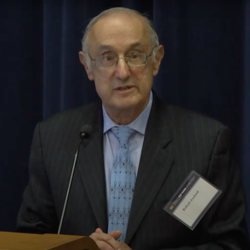
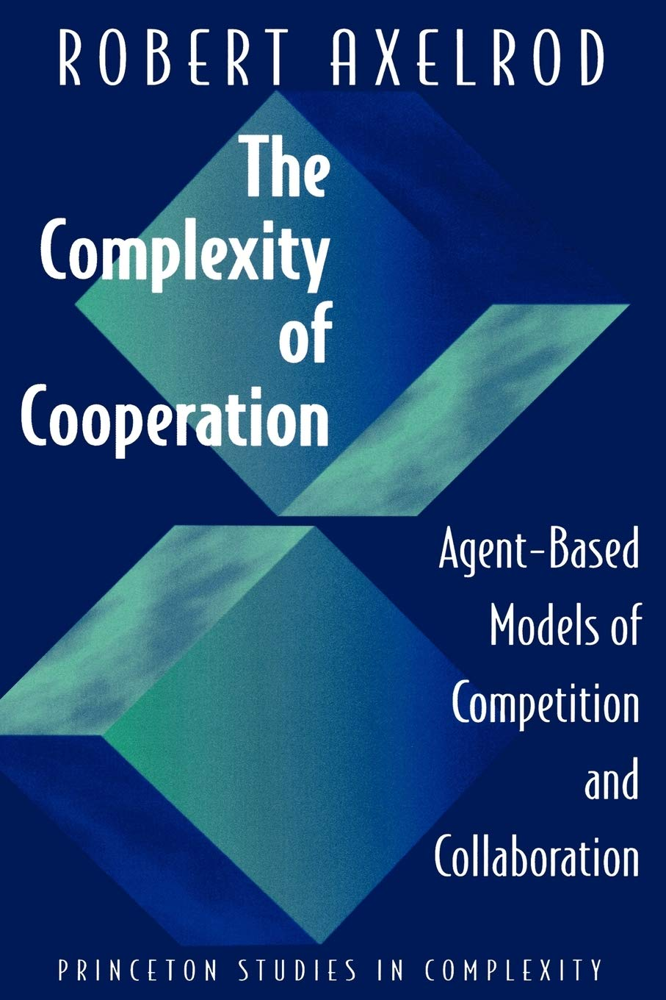

---
## Front matter
title: "Модель культуры Аксельрода"
subtitle: "Доклад"
author: "Надежда Александровна Рогожина"

## Generic otions
lang: ru-RU
toc-title: "Содержание"

## Bibliography
bibliography: bib/cite.bib
csl: pandoc/csl/gost-r-7-0-5-2008-numeric.csl

## Pdf output format
toc: true # Table of contents
toc-depth: 2
lof: true # List of figures
lot: true # List of tables
fontsize: 12pt
linestretch: 1.5
papersize: a4
documentclass: scrreprt
## I18n polyglossia
polyglossia-lang:
  name: russian
  options:
	- spelling=modern
	- babelshorthands=true
polyglossia-otherlangs:
  name: english
## I18n babel
babel-lang: russian
babel-otherlangs: english
## Fonts
mainfont: IBM Plex Serif
romanfont: IBM Plex Serif
sansfont: IBM Plex Sans
monofont: IBM Plex Mono
mathfont: STIX Two Math
mainfontoptions: Ligatures=Common,Ligatures=TeX,Scale=0.94
romanfontoptions: Ligatures=Common,Ligatures=TeX,Scale=0.94
sansfontoptions: Ligatures=Common,Ligatures=TeX,Scale=MatchLowercase,Scale=0.94
monofontoptions: Scale=MatchLowercase,Scale=0.94,FakeStretch=0.9
mathfontoptions:
## Biblatex
biblatex: true
biblio-style: "gost-numeric"
biblatexoptions:
  - parentracker=true
  - backend=biber
  - hyperref=auto
  - language=auto
  - autolang=other*
  - citestyle=gost-numeric
## Pandoc-crossref LaTeX customization
figureTitle: "Рис."
tableTitle: "Таблица"
listingTitle: "Листинг"
lofTitle: "Список иллюстраций"
lotTitle: "Список таблиц"
lolTitle: "Листинги"
## Misc options
indent: true
header-includes:
  - \usepackage{indentfirst}
  - \usepackage{float} # keep figures where there are in the text
  - \floatplacement{figure}{H} # keep figures where there are in the text
---

# Введение

Роберт Аксельрод - известный американский политолог и экономист, который внёс значительный вклад в изучение моделей организационной и социальной культуры. В частности, вместе с Э. Аксельродом он разработал конференциальную модель культурного распространения с использованием клеточных автоматов. Модель дает вычислительную и теоретическую основу для изучения появления культуры посредством взаимодействия между людьми. С помощью простых правил модель позволяет изучать влияние людей, имеющих сходные черты, становятся все более похожими, а также возможный противоракатический эффект, при котором тенденция к локальному сходству приводит к глобальной поляризации.

{#fig:001 width=40%}

# Основные элементы

Модель распространения культуры Роберта Аксельрода — это пространственная стохастическая модель динамики культур, опубликованная в 1997 году. Аксельрод использует слово "культура" для обозначения "набора индивидуальных качеств, которые подвержены социальному влиянию". Он утверждает, что культура - это "то, чему люди учатся друг у друга", и, следовательно, то, что развивается благодаря социальному влиянию. 

**Цель модели** — изучить, почему сохраняется культурное разнообразие, несмотря на то, что при взаимодействии люди становятся более похожими друг на друга.\

{#fig:002 width=40%}

В основе модели лежат два предположения:

1. Люди с большей вероятностью будут взаимодействовать с теми, у кого есть много общих культурных атрибутов.
2. Взаимодействие между людьми увеличивает количество общих атрибутов.

Наглядным примером, приведенным Аксельродом, является язык: "человек с большей вероятностью будет разговаривать с кем-то, кто говорит на похожем языке, чем с тем, кто говорит на непохожем языке, и сам акт общения, как правило, делает их будущие речевые модели еще более похожими". Затем Аксельрод отмечает, что в связи с этим рассуждением возникает вопрос: "Если люди, взаимодействуя, становятся все более похожими в своих убеждениях, установках и поведении, то почему все эти различия со временем не исчезают?". Таким образом, цель этой модели - изучить, почему культурное разнообразие сохраняется, даже несмотря на то, что люди склонны сближаться друг с другом в культурном плане посредством самоподкрепляющегося механизма "большего взаимодействия" <-> "большего сходства".

# Описание модели:

- Есть квадратная решётка клеток, каждая из которых представляет стационарного человека с определённой культурой.
- Культура человека характеризуется списком $f$ признаков или измерений культуры (например, язык, религия, стиль одежды).
- Для каждого признака есть набор черт $q$, которые являются альтернативными значениями этого признака.
- Таким образом, культура индивида $i$ представлена вектором $x_i$ из $f$ переменных, где каждая переменная принимает целое значение в диапазоне $[0, q-1]$.
- Изначально людям присваивается случайная культура.
- Параметр $q$, который определяет возможные черты в каждом культурном измерении, можно рассматривать как показатель первоначального беспорядка или культурного разнообразия в системе.
- На каждом шаге времени один активный человек выбирается случайным образом, затем один из его соседей.
- Активные и пассивные люди взаимодействуют с вероятностью, равной их культурной схожести.
- Активный человек выбирает случайный признак, по которому они отличаются, и копирует черту пассивного человека.
- Этот процесс продолжается до тех пор, пока не произойдёт изменение культуры.

В модели могут возникать как отдельные культурные регионы, так и глобальная поляризация в зависимости от культурных возможностей, диапазона взаимодействий и размера географической территории.

# Отличие от других моделей

С математической точки зрения, модель культуры Аксельрода отличается от других моделей культуры несколькими ключевыми аспектами:

1. Векторное представление агентов:

Агенты описываются векторами признаков: Каждый агент в модели Аксельрода представлен вектором фиксированной длины $F$ (число культурных признаков), где каждый элемент может принимать одно из $q$ значений (число возможных вариантов для каждого признака). Это отличает её от, например, моделей типа "voter model", где у агента есть только одно состояние (мнение).

2. Динамика на основе гомофилии и социального влияния:
  
  - Вероятность взаимодействия зависит от сходства: В модели Аксельрода вероятность того, что два агента будут взаимодействовать, прямо пропорциональна числу совпадающих признаков (гомофилия). В других моделях, например, в модели Изинга или "voter model", взаимодействие происходит случайно или по фиксированным правилам, не зависящим от степени сходства.

  - Механизм изменения: При взаимодействии один агент копирует у другого только один отличающийся признак, делая их более похожими. В классических моделях распространения мнений (например, Sznajd, Schelling), изменение состояния агента может происходить по другим, зачастую более простым, правилам.

3. Пространственная организация

Агенты обычно размещаются на решётке, и взаимодействуют только с ближайшими соседями. Это создаёт возможность для появления пространственных кластеров культурных регионов, что не всегда реализовано в других моделях.

4. Многообразие исходов

Модель способна воспроизводить как полную унификацию (моно-культуру), так и устойчивое сосуществование множества культурных регионов (поляризация), в зависимости от параметров $F$ и $q$. В большинстве других моделей конечное состояние - это либо полная гомогенизация, либо случайное распределение мнений.

5. Размерность пространства состояний

Число возможных конфигураций системы в модели Аксельрода равно $q^{F \cdot L^2}$, где $L$ - размер стороны решётки. Это делает модель значительно более сложной для анализа и симуляции по сравнению с моделями, где у агентов меньше степеней свободы.

6. Расширяемость
В расширениях модели Аксельрода допускается смешение номинальных и метрических признаков, что позволяет моделировать более сложные типы культурных различий. Многие классические модели не обладают такой гибкостью.

# Минусы модели

1. Ограниченность локальными связями: 

Классическая модель учитывает взаимодействия только между ближайшими соседями, что не отражает современные высокомобильные и глобальные коммуникации, где «дальние» связи играют значительную роль.

2. Абстрактность временных масштабов: 

Временные шаги модели (например, 70 000 шагов) не имеют чёткого соответствия реальному времени, что затрудняет интерпретацию и применение результатов к конкретным социальным процессам.

3. Гомогенность среды: 

Модель предполагает однородное пространство без учёта географических, языковых или социальных барьеров, которые в реальности влияют на культурное разнообразие и взаимодействия.

4. Случайное начальное распределение: 

Начальные условия задаются случайно, что может не отражать реальные исторические или социальные предпосылки формирования культур.

5. Сложность масштабирования: 

При увеличении числа агентов и признаков растёт вычислительная сложность, так как пространство состояний экспоненциально увеличивается, что ограничивает практическое моделирование больших популяций

# Заключение

Модель Аксельрода математически выделяется векторным (многомерным) описанием агентов, вероятностной динамикой на основе гомофилии, локальной структурой взаимодействий и способностью воспроизводить устойчивое культурное разнообразие, что отличает её от более простых или одномерных моделей распространения мнений и культуры.

# Список литературы{.unnumbered}

::: {#refs}
:::
